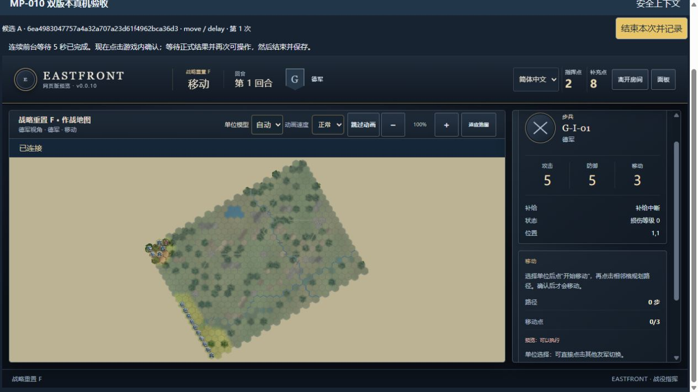
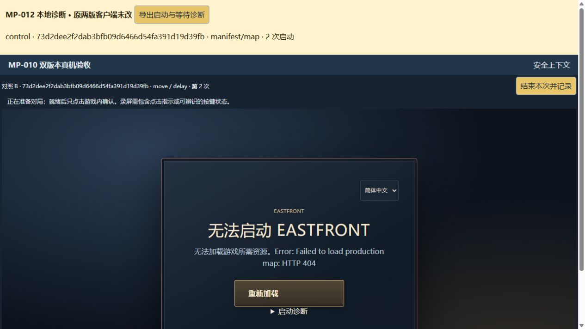

# MP-012：启动失败与操作等待的本地诊断

执行日期：2026-10-03（北京时间）。独立分支 `mp-012-diagnostics`，开发及现场证据基线 `0ca8d312c0e74f58a37121b6207c78aae546ffa1`。候选源码 `6ea4983047757a4a32a707a23d61f4962bca36d3`、对照源码 `73d2dee2f2dab3bfb09d6466d54fa391d19d39fb` 均保留。

## 结论

**A：华为现场“加载地图时报错”未在本地复现，根因仍未知。** 本地两版均加载成功并完成移动；不能由此排除真机问题，也不能把人工制造的 404 当成现场根因。本轮不修改正式客户端，不创建猜测性修复候选。

**B：旧现场数据只能分成三段，不能事后还原接收/解码时间。** 新增诊断已在本地取得完整客户端时间线，并确认现有移动后的查询会延后解除操作阻塞；未证明查询占用了现场全部 1.141 秒，也未证明网络、服务器或设备中的哪一项是现场瓶颈。

仅新增 `scripts/mp012/`、一项定向测试文件、本报告与 `evidence/mp-012/`。诊断通过本地 HTML 入口覆盖层加载，原编译客户端、Core、服务器、协议、认证、FOW、MP010 采样器和旧证据均未改。没有公网入口、生产部署、合并或付费资源；本地诊断进程已关闭。

## 真实现场证据：可知与缺失

引用原 [华为补录](../evidence/mp-011-r1/huawei-followup-original.json) 和 [同期边界日志](../evidence/mp-011-r1/huawei-followup-boundary.json)，不重写、不追加成新的真机样本。

| 候选移动单次记录 | 耗时 |
| --- | ---: |
| 点击→ACK | 371.8 ms |
| ACK→授权 snapshot 实际应用 | 858.9 ms |
| 应用→恢复操作 | 1141.0 ms |
| 点击→授权应用 / 恢复操作 | 1230.7 / 2371.7 ms |

输入到发出为 2.2ms；记录了 2 次 Query、0 次 RESYNC。没有逐次查询时间、snapshot 消息回调入口、解析/解码、服务端计算或构建时间。因此 858.9ms 混合了未知服务端处理、传输及客户端接收处理；1141ms 也不能全部算作查询或渲染时间。rAF 42.3ms 只是帧机会，不是实际可见反馈。

对照失败记录在“开始下一次后加载地图”阶段，metrics/preparation 为空，没有错误原文或栈。连接边界记录 101、不含连接错误，仅证明当时升级成功。旧构建服务设置 no-store，但这不是该平板实际缓存命中情况的证据；现场缺资源状态、解码异常和 service worker 状态。不能归因于校园网、地区或设备性能。

## 构建、资源和本地复现

先通过原 MP010/R1 包逐文件校验，再沿原 `/v/{version}/move/{mode}/` 相对地址提供资源。新增覆盖层只替换内存中的 HTML 模块入口；`multiplayer-config.json` 仍由原夹具按当前本机 origin 生成，未改磁盘文件。

[HTTP 核验](../evidence/mp-012/local-http-audit.json)：候选 388、对照 385 个资源请求全部为 200、no-store；除上述明确的 HTML/动态配置例外，其余字节匹配固定 manifest。检查 JS/JSON/HTML MIME。全部资源是本机包中的资源，不通过生产服务。最初 Node fetch 对 4190 报 bad port，资源审核脚本改用 Node http 客户端；该工具限制发生在 HTTP 请求发出前，不是游戏资源失败。实际本地 IAB 已验证能访问此端口，未来浏览器若限制该端口，应先调整整套本地 origin/监听并重验，不跳过浏览器限制。

[本地浏览器原始导出](../evidence/mp-012/local-browser-original.json)：Windows / Codex IAB，回环连接、无人工延迟，两版地图及移动均成功。原采样口径的记录另存 [local-common-sampling-original.json](../evidence/mp-012/local-common-sampling-original.json)。这些属于本地诊断，不计旧真机验收配额。

| 本地观测，ms | 候选 | 对照 |
| --- | ---: | ---: |
| 发出→ACK 被会话处理 | 34.1 | 19.0 |
| ACK→snapshot 消息回调入口 | 7.3 | 0.8 |
| JSON 解析边界 | 0.3 | 0.4 |
| snapshot 解码边界 | 4.2 | 2.9 |
| 解码结束→授权应用 | 0.8 | 0.8 |
| 应用→消息处理返回（含同步 UI 工作） | 24.2 | 21.5 |
| 应用→再次可操作 | 48.7 | 44.6 |
| 点击→再次可操作 | 95.7 | 68.9 |

本地每版一次；两次均在对应 Query 处理后恢复操作。候选查询从发送到接收回调约 6.9ms，对照约 5.9ms；其余应用后时间包括同步界面工作、调度和查询处理，不可只算网络。新观测器和旧采样器读取时点相邻但不完全相同，个别结果相差 0.1ms，保留各自原值。

本地 WebSocket 协商为 permessage-deflate，现场导出为 none；没有改动服务器协商。本机、浏览器、压缩、网络路径与现场不同，不用这些数字证明性能改善或设备优劣。无 instrumentation-off 配对测量，诊断本身也有开销。

## 新增诊断边界

所有动作时间都来自**同一个游戏 iframe 的 performance.now()**。外层页面只记录自己的启动尝试并明确为独立时钟，不跨 iframe 或与服务端时钟相减。

- 捕获点击；保留请求发出时刻、requestId 和基准 revision。即时反馈只记录 DOM 状态出现后的 rAF 帧机会，实际可见反馈仍为 null，需录像。
- 复用原只读 transport 事件，记录 snapshot 回调入口、JSON parsedAt、decodedAt、整个处理返回时刻。接收回调时间不是网络包抵达硬件的时刻；parse 区间含原字符串检查与协议基本校验。
- 在原会话已应用授权 snapshot、尚未同步渲染的 onChange 边界记录实际 appliedAt。它不同于原 transport 字段 appliedAt（后者实际是处理返回），导出明确命名 handlerEndAt。
- 只有被会话合法消费的同 requestId ACK 才固定 acceptedRevision；通过内部对局/观察权限范围和 revision 关联实际应用，保留 first application time。晚 ACK 可在稍后建立关联，但不会把 ACK 时间替换成应用时间；无关 revision/观察权限范围不参与。每请求 completionCount 最多 1，完全不控制状态应用。
- 记录查询 requestId、revision、发送/回调/处理返回，以及 submitting、queryQueued、queryInFlight、transportPending、syncing、canAct 等阻塞标志。恢复时间来自实际 interactive=true 的接收处理边界，不人为提前解锁。
- 启动记录实际源码 SHA、诊断脚本指纹、阶段、已知资源相对路径、状态/体积/响应时间、缓存提示、已有图片加载/解码尝试和脱敏栈文件行列。未捕获的时间保留 null。图片 image 事件混合传输与解码，不能强行拆分；显式解码尝试存在时沿用原 loader 记录。
- 全局未捕获异常、Promise 拒绝，以及原 `EASTFRONT startup failed` 捕获点可在动作未产生前导出。丢弃原始 error.message、URL 查询参数、非清单路径和函数文本；不记录 cookie、token、DTO、单位/坐标或 FOW 数据。

诊断只在专用入口加载。最多 128 条请求/版本缓存、2048 个事件、外层 12 次启动；超量有 dropped 计数。阶段和接收进度按 250ms 合并向外层发送，错误与手动导出立即发送；外层刷新会丢失内存历史，必须先导出。若诊断模块本身未加载，外层保留导航尝试，但异常详情仍可能缺失，不推断启动成功。

最初本地 A/B 原件使用诊断指纹 `49d2d4bb5b2b66f2a16c592249795fe2f35d92a26e620fa3934250e4b25bdea0`；其事件里的 move/pending-marker/status-change 类型是早期子类型命名，图片相对路径有 null。随后只改诊断层：规范事件名、批量发送、补唯一清单路径映射及人工故障标识，最终指纹为 `717fee6da0df5d272a656aa869c5182a43f7d0d789227b6db24b1cfa8dedaa98`。原件不覆盖，最终版本通过以下延迟及启动故障验证。

## 人工场景与定向验证

- [人工延迟](../evidence/mp-012/local-delay-original.json)：复用既有 FIFO 夹具 ACK 1.8s、snapshot 4.5s。候选发出→ACK 为 1829.7ms，ACK→snapshot 回调为 2687.5ms，解码 3.7ms，应用→可操作 44.1ms，总输入→可操作 4566.7ms。这验证分类边界，不代表实际网络延迟。
- [人工资源故障](../evidence/mp-012/synthetic-map404-original.json)：仅本地覆盖网关对固定地图文件返回 404；两版都导出 manifest/map、HTTP 404、Error 类型及固定 app 文件栈行列，actions=[]。**不是原华为故障的复现或根因证实。** fixtureFault=map404 与正常数据分开。
- [20 项定向测试](../evidence/mp-012/targeted-tests.txt) 通过：MP009-R1 关联/恢复、MP010-R1 异常分类/五秒前台等待、新诊断迟到 ACK、错误范围/版本、人工延迟、缺失值、容量与脱敏等。核对回归测试使用的 dist 客户端文件与固定候选一致。
- [范围审计](../evidence/mp-012/scope-audit.json)：逐项检查 1751 条冻结记录、518 个唯一文件和 8 个 manifest，无新增冻结差异；原 UA002 / UA003 / UA003R1 三项红项及 [完整历史差异](MP-009-R1.md) 不变。不刷新清单、不重跑无关全量、不称全量 Green。

[复跑核验摘要](../evidence/mp-012/review.json)、[SHA256 清单](../evidence/mp-012/checksums.json)。截图为本地诊断环境：





## 本地复跑和下一次真机的最小步骤

在本工作区保留的 `.mp010-build/artifacts/` 上运行，缺固定包时会校验失败，不能跳过校验或用新包冒充旧包。不要为复跑本报告重新覆盖 MP010 原证据。

```powershell
node scripts/mp010/integrity.mjs
node scripts/mp012/audit.mjs
node --test tests/mp009-r1-correlation.test.mjs tests/mp009-r1-recovery.test.mjs tests/mp010-r1-sampling.test.mjs tests/mp012-diagnostics.test.mjs
node scripts/mp012/review.mjs
# 本地专用，双监听均为 127.0.0.1；保留运行终端。
node scripts/mp012/serve.mjs
# 在另一终端核查实际资源：
node scripts/mp012/audit.mjs --http
# 停止后才可切换故障模式；禁止连接公网隧道。
pwsh -NoProfile -File scripts/mp012/stop.ps1
node scripts/mp012/serve.mjs --fault=map404
pwsh -NoProfile -File scripts/mp012/stop.ps1
```

本地入口 `http://127.0.0.1:4190/`，后端夹具仅 `127.0.0.1:4192`。操作时先选择“桌面预检／本机回环预检／暖机”，场景普通移动；真实网络选项在此仅表示不注入延迟。无其他浏览器设置修改、无新增服务器协议和认证通道。

**本轮不安排用户重试。** 下一次恢复受认证真机预览时，先重新审核发布入口配置，不能把本轮回环服务直接暴露。一次华为对照启动即可：填写型号、系统/浏览器版本，保留相同方向；一旦报错，留在当前页，点击“导出启动与等待诊断”，另记屏幕错误，立即停止重试。若启动成功，再做一次普通移动，等“已连接”及按钮恢复后保存原采样 JSON，同时导出诊断 JSON；需要真实首帧指标时仅录这一操作。无需重收十次配额。诊断要能关联两版对照时保留同一网络和页面条件，iPad 不以桌面/华为结果替代。
