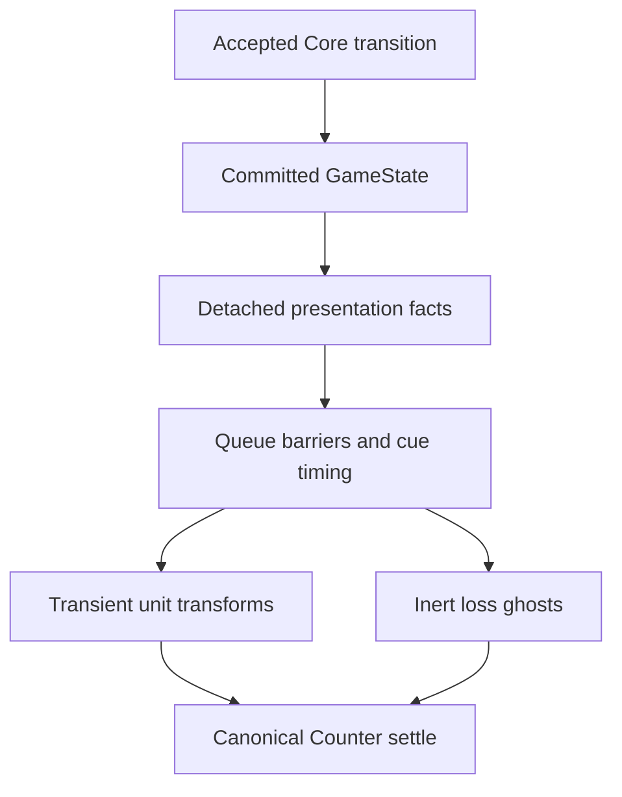

# EASTFRONT UA-002 — Tactical Motion & Combat Presentation

Baseline commit: `8a817dc0abfa1999ac9262108c139ca508fa798a`
Baseline tree: `68c404eb633401448eb64b8040ffbc909fa83678`

The baseline was CLEAN before work; baseline typecheck, build and all 301 tests passed.
This is the animation line. No deployment or UA-003 work is included.

## Architecture and rule boundary

Only `src/presentation/` changes at runtime. `main.ts`, the session adapter,
transition bus, rule engine, interactions, geometry, Counter V2, terrain and startup
remain byte-identical. An accepted transition has already adopted Core state before
its immutable presentation events are published. No animation callback dispatches an
action, writes GameState, queries legality or consumes gameplay RNG.



`CombatDeclared` starts attacker emphasis. A pending defender decision can remain
pending with no fire. Only an accepted result containing `CRTResolved` produces
`combat-fire` and `combat-result`. Detached cue participants contain existing type
character, canonical pixel anchor, stack offset and facing direction; they carry no
combat strength, CRT result, supply or legality. Existing unit IDs remain available
for lifecycle hooks.

The queue keeps setup → staggered fire → result → hit → destruction barriers.
Adjacent loss facts in the same accepted action are coalesced into one short hit per
affected unit, then destruction runs in parallel across different units. Original
events remain available unchanged. Retreat, advance and breakthrough are appended
only when their respective Core actions are accepted, in their original order.
No player decision is invented or automatically taken by animation. Explicit parallel
steps that share a unit (including fire participants) serialize safely.

## Motion profiles and timing

All time values live in `src/presentation/timing.ts`; easing, amplitudes and LOD weights
live in `src/presentation/motion.ts`. There are no timers scattered across the UI.

| Action | Normal duration | Character |
|---|---:|---|
| MOVE | 260 ms / accepted segment | Quintic acceleration/deceleration, 2.6-unit lift, modest scale, dark contact cue; settle within the step |
| RETREAT | 190 ms / accepted segment | Earlier travel acceleration, low lift, short rearward cue; accepted loss reaction precedes retreat |
| ADVANCE | 215 ms / accepted segment | Direct arrival and one forward chevron |
| BREAKTHROUGH | 165 ms / accepted segment | Earlier acceleration, stronger scale/lift and two forward chevrons |
| Windup | 110 ms | Small attacker emphasis outside the Counter face |
| Fire | 130 ms + stagger | 28 ms spacing; total stagger capped at 84 ms |
| Hit | 120 ms | Small damped displacement and warm corner cue |
| Destroyed | 170 ms | Fade and modest collapse, then remove the ghost |

`hexToPixel` provides every travel waypoint. Easing never changes the accepted path,
legality or canonical endpoints. Stack placement still comes from Counter V2's existing
placement function. Lift/recoil affect presentation only; touch targets follow canonical
travel anchors. Arrival and Skip restore the exact canonical Counter transform.

Fast uses 0.4× durations; Instant and reduced motion settle immediately. Skip during
fire, hit or destruction clears both runtime work and presentation DOM. Existing
animation controls and their zh-CN/en-US labels remain unchanged.

## Combat visuals and readability

Fire is a small directional vector burst with recoil. Infantry, armor and artillery
profiles provide broad existing-type character; unsupported types use generic cues.
This does not add weapon models, calibers, ranges or effects to the rules. The actual
transaction's attack group determines which attackers fire; the order is deterministic
and uses no entropy. Supporting weapons outside that attack group are not invented.

Hit corners sit outside the Counter face. Final damage marks, NATO symbols, selection
and stack badges always come from the unchanged canonical renderer. The effects do not
write those elements.

A destroyed Counter is copied once after Core accepts destruction but before the next
map remount. The old Counter and hit target are removed immediately. The artwork copy
has all gameplay identity, focus, role and handler attributes stripped recursively;
`pointer-events="none"` is set on the root and every descendant, with `aria-hidden` on
the root. Only the visual damage styling attribute is retained. It cannot be selected
as a unit. The ghost can finish the already-queued fire/hit sequence, fade, then vanish.
Completion, Skip, Instant, reduced motion, session replacement, hidden-map cleanup,
disposal and the existing pagehide Skip hook all release temporary DOM and RAF work.

## LOD and performance

Far / medium / close cue weights are 0.18 / 0.72 / 1. Far fire uses a smaller mark;
Counters retain priority. The renderer measures fitted SVG width only on bind and
reads the camera's existing scalar zoom during playback, using the existing LOD
thresholds. It never writes camera transforms, invokes FIT or recenters the map.

The coordinator precomputes canonical travel points on enqueue. Frames use detached
presentation data and update affected Counter transforms, hit translations, opacity
and one reusable lightweight SVG path per affected unit. A bind can inspect current
Counter DOM; a frame does not query Core, clone GameState, build map markup, draw
particles, recreate terrain surfaces or run world raster work. The 80-frame software
regression leaves static nodes untouched and creates no more than five effect paths.
The existing real VS2 cache test still verifies no rebuild over 60 frames/remounts.
These are software regressions, not device FPS measurements.

Normal software traces: no-loss single attack 240 ms; single attacker with destruction
530 ms; three attackers with defender destruction 586 ms. The full sampled tactical
chain (two retreat segments + advance + breakthrough) is 1,120 ms. These exclude human
choice pauses and are presentation durations, not measured browser click latency.

## Validation and frozen scope

- Final `npm run typecheck`: PASS.
- Final `npm run build`: PASS.
- Final `npm test`: **324 / 324 PASS**, 0 failed, 0 skipped.
- Baseline: **301** tests. Added: **23** tests. Final total: **324**.
- `git diff --check`: PASS.
- Frozen audit: **703 of 712 baseline files byte-identical**. The nine changed baseline
  files are five presentation runtime files and four test/fixture files. One additional
  runtime file, `motion.ts`, contains only presentation profiles.
- Core/vendor, CRT, odds/modifiers, all legality, supply, victory, deployment, RNG,
  canonical map/scenario/geometry, VS2, Camera, Counter mechanics, Combat UX2.1,
  localization/default Chinese, fresh-game creation and complete startup loader/shell
  are unchanged. HTMLImageElement-first order, fallback, timeout and cache are unchanged.

The 23 new tests cover actual accepted movement/retreat/advance/breakthrough paths;
accepted-only fire; all multi-attackers and bounded stagger; hit/state isolation;
ghost input isolation and canonical absence; Skip in fire/hit/destruction; fast,
instant and reduced-motion equivalence; RNG and per-frame state-read guards; live
LOD/camera preservation; actual Combat UX2.1 bindings and duplicate submits; startup
byte freezes; bounded DOM allocation/cleanup; language switching; and explicit
parallel conflicts. Existing fresh NEW GAME seed and six-seed combat equivalence
regressions remain intact.

No old test was deleted. The old startup task's requirement that presentation modules
remain byte-identical is intentionally superseded by this animation task. Its session
adapter/transition bus byte check remains, all loader/VS2 behavioral and byte checks
remain, and UA-002 freezes all other source files. The old lifecycle event fixture now
contains cue participants; the old localization DOM stub gains `querySelector`; their
behavioral assertions are unchanged. The animation DOM helper now supports real SVG
child operations needed to test ghost safety.

## Review evidence

Open `evidence/ua-002/review.html` for eight GIFs and corresponding PNG/SVG frame strips:
move, retreat, advance, breakthrough, single combat, multi-combat, hit and destroyed.
The move before/after strip loads the actual baseline implementation with `git show`
and TypeScript transpilation, rather than approximating its motion.
`traces.json` records accepted events, Core facts, canonical final units, per-frame
presentation samples and any outstanding decision. All images are **software-rendered**
from real production presentation/Counter code using the minimal SVG DOM and
sharp/librsvg. The backdrop is a plain canonical-hex fixture, not a VS2 capture.
GIFs retain normal playback timing with 400/700 ms review holds at their endpoints.
The tactical sampling accepts the explicit decisions before playback so the entire
sequence can be reviewed; it does not change the game's decision flow.

Reproduce after restoring the Git bundle (baseline commit is needed for comparison):

```sh
npm ci
npm run build
node scripts/export-ua002-evidence.mjs
python3 scripts/audit-ua002-scope.py
```

Optional raster/GIF export requires sharp and Pillow outside production dependencies:

```sh
node scripts/rasterize-ua002-evidence.mjs evidence/ua-002 /tmp/eastfront-ua002-frames
python3 scripts/animate-ua002-evidence.py /tmp/eastfront-ua002-frames evidence/ua-002
```

The rasterizer uses `CODEX_PRIMARY_RUNTIME_NODE_MODULES` to locate sharp in this
workspace. Production runtime and build acquire no new dependency.

## Known limitations

**browser manual validation pending**. Local SVG evidence is not a real browser capture;
no Huawei hardware, touch-hit testing, GPU composition or device performance PASS is
claimed. Live resize during playback recalibrates fitted width on the next normal DOM
bind. Supporting artillery that is not in `attackerUnitIds` has no separate firing cue.
There is no 2.5D miniature, cinematic camera, particle simulation or deployment in this
checkpoint. Human decision pauses are preserved and excluded from animation timing.

No Core changes. No combat rule changes. No gameplay RNG changes.
No startup loader strategy changes.

READY FOR LEADER REVIEW
