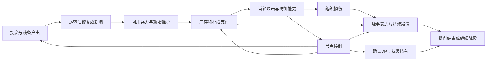

# CAMPAIGN-001 24回合大战役闭环实验报告

2026-10-02。EASTFRONT研究交付，独立分支`campaign-001`，未合并、未部署。**结论：账务与因果连接部分成立；完整战略循环尚未通过验证。** 工业能够增加实物，补给能限制行动，VP能记录战略控制，战争意志能反映可恢复压力；但本组实验中，工业收益经常停在仓库，苏军反攻没有完成地域收复，后期行动选择也未改变终局VP。不能据此宣布规则已形成健康闭环。

本报告全部游戏数量、分数、周期、价格、阈值和推演结果均标记为**实验参数**，不是平衡值、史实或运行配置。研究任务号、日期、版本与审计数量为交付元数据。本次没有修改Core、AI、地图、规则代码或部署配置。

交付入口：[基础假设与复算方法](METHOD.md)｜[A闪击账本](LEDGER_A.md)｜[B工业账本](LEDGER_B.md)｜[C后勤账本](LEDGER_C.md)｜[路线与对照汇总](COMPARISONS.md)｜[边界算例](BOUNDARIES.md)｜[参数](PARAMETERS.json)｜[完整逐单位数据](LEDGER_DATA.json)｜[审计结果](AUDIT.json)。三条主路线各有双方完整24回合；另有不投资、消融、来源不足、断供与晚期决策对照。

## 1 战略循环的验证结论

本轮把前次只有工业/补给的单方账，扩为双方共同结算的战役账。占领时间不是预先指定：攻击支付、当前伤阶、敌防御共同决定抽象战线推进；节点控制再影响产能/运输、VP与地点压力。双方每轮记录存活单位、损伤、恢复、库存、货运、建设与意志。

箭头表示已纳入账本的依赖，不表示每一环都通过战略效度验收。战争意志只决定是否继续，没有反向降低战斗/生产的额外惩罚。

|检查|本轮结果|判定与限制|
|---|---|---|
|双方资源、单位、损伤、物流能否跨完整战役结算|四账可守恒，VP/W可由同一E末状态重算|账本通过；不是游戏事务或真实回放验收|
|工业产出能否转化为行动与VP|能增加产物；主场景取消工业后B仍相同VP/兵数且攻击机会更多|默认条件下工业战略收益不足，未通过|
|断供能否恢复并改变计划|断供后改整补，通道恢复后分步偿债，部分损伤需另修|条件通过；当前耗损速度为压力假设|
|防御保存主力后能否工业恢复并反攻|苏军保住主力、完成恢复，有反攻行动；没有收复节点|只走到“反攻行动”，完整反攻闭环未通过|
|VP是否避免首都单点决定胜负|分值与边界算例通过；主战役不靠首都判投降|自由目标选择尚未验证，单链模型有偏置|
|晚期是否仍有改变战役结果的选择|强攻/整补改变损伤、W与消耗，但主场景VP不变|战役决策密度不足，24回合适配未通过|

## 2 起点与三条路线

以下全部为**实验参数**。默认尺度1格约10公里、1回合约1周、T1至T24。账本只有抽象节点，不改格位、移动或地图。G初始8步兵师、3装甲师、1工兵群；S初始10步兵师、3坦克旅、1工兵群。师旅分别使用组织权重4/2，支援1，避免把一个旅与一个师同值计入战争意志。

双方各12I；G/S人员72/84P、初始SP45/51、基础来源24/26SP每轮、共享运输24/26负载每轮；每方基础装备产出2E，前仓2E。不存在免费T16以后增援。新编、维修、回收与物流都付账，详细单位费用及门槛见方法文件。

|路线|投资与早期取舍，均为实验参数|期待检验|
|---|---|---|
|A 闪击|12I急拨12E，集中既有装甲并先新编两个装甲师；放弃新增工业/运输|能否用早期VP抵偿长期维护压力|
|B 工业|8I扩产、2I运输、2I回收；先防御建设，T5出击|T10以后能否把更多装备变成有用优势|
|C 后勤|8I铁路运输、4I回收；先改善到货和铁路延伸|能否维持更长攻势，而非仅提高库存|
|共同苏军|8I工业恢复、4I运输；前期守备、中期修复与新编、T13起反攻|保存主力能否支持后期夺回VP|

实验参数节点共100VP：首都20、两城各10、两工业地域各10、两铁路各10、两入口各10。初始G/S已确认30/70，守方初始优势公开；未用隐藏补偿制造对半结果。确认需两个E，最终70%终局控制＋30%平均持有，不送歼敌或库存VP。

## 3 三条主路线比较

下表所有数值和结果均为**实验参数下的推演**；“攻击机会”是单位代理机会，既非独立战斗场数，也非真实合法命令数。

|德军指标|A 闪击|B 工业|C 后勤|
|---|---:|---:|---:|
|最终确认控制VP|40|50|50|
|持有累计H|940|1090|1130|
|加权最终VP|39.750|48.625|49.125|
|苏军加权最终VP|60.125|51.125|50.625|
|VP差及候选结果|−20.375，苏有限胜|−2.500，平局|−1.500，平局|
|德军主动进攻回合|5|4|10|
|满效/减效单位攻击机会|49/14|51/11|96/42|
|T10至T24满效机会|10|13|28|
|期末存活/累计消灭|17/0|19/0|19/0|
|新编/累计损伤阶/恢复阶|5/9/9|7/8/8|7/15/15|
|原生产出含急拨E|60|71.75|48|
|设备回收E|0|3.25|7.5|
|期末前方/后方E|24/8|24/24|21.5/0|
|全期维护SP|491|485|469|
|全期行动实付SP|69|65.25|140|
|期末W|100|100|100|

**A买到了早期窗口，却没有持续兑现突破。** 实验中T2夺西城、E3确认；较B更早，但之后没有新增节点。装甲既有较高攻值，也付更高维护和机动补给。改为全新编步兵的A对照最终19单位，VP仍39.750，说明问题不能只怪装甲采购；来源/运力与行动恢复也在约束它。

**B的产线完成不等于T10以后获得战略优势。** T5夺西城、T6夺铁路、E7确认50VP，较高得分含前四轮保存库存后集中突击的策略收益，不能全部归因工业。此后直至T20才再主动出击，期末双仓共48E。工业、运输和维修确实形成了更多装备，但它们没有自动解决维护后的行动弹药不足。

**C维持攻势最好，但“更持久”仍不是“长期不断攻”。** T2夺西城、T5夺铁路，较B早一轮确认第二目标，最终多0.5VP来自持有时间。C有10个进攻回合和96个满效机会，仍有大量整补轮；基础SP来源未随运输扩张，部队增多后再次遇到来源限制。不能把C定为平衡最优路线。

主样本双方没有单位被消灭、没有维护欠额、S压力均为0；W结尾G100、S分别96/92/92。它们主要在争夺行动余量而非生存维护。**这组主账不能证明持续崩溃规则在真实战役中触发得恰当**，需要断供和独立边界算例补充。

## 4 工业 补给 VP是否互相支持

### 工业值得投资的条件仍不充分

以下对照数值均为**实验参数**。取消B的8I工业投资，保留同样前四轮等待、运输与回收，期末仍19单位、相同48.625VP，满效机会从51变60，T10以后从13变22；还保留8I。这个对照比A/B直接排名更明确：**默认条件下，B的工业支出没有产生可证明的战役收益，额外产出挤占装备与SP共用货运。**

在双方来源各+16SP、通道各+20的宽松后勤对照中，B投工业/不投工业期末30/22单位、93.125/92.875VP；但满效机会174/235，T10以后102/165。更多产能能支持更多兵力并稍早形成控制收益，却也促进更大维护负担，不能用兵数或那0.25VP宣称全面更强。投资收益是有条件、分指标的。

双方来源都只有10SP的压力实验中，A/C各39.750VP、B30VP，工业没有补上SP来源。结合早期窗口和保留现金对照，可以排除“工业无条件最佳”；目前也没有足够证据排除“更好的即时扩军策略总能替代本工业方案”。**工业功能存在，但工业选择尚未通过验收。**

按当前报价，单独8I工业对比8E急拨，E4起每E多2E，E7累计8E，最早T8可使用，这是**实验参数下的物量替代时点**；不是I现金回本，不含早期占地机会成本，更不是T10自动增益开关。装运、恢复/新编名额、人员、SP及剩余有效目标窗口都必须继续满足。

### 补给产生了恢复选择 但安全维护不足以保障攻势

实验参数断供对照：E8至E10德军总通道为0，E11恢复，初始库存与物资来源保留。各路线E11恢复足额维护，最高D到E13才清零，期间必须整补；C在T14重新进攻。恢复没有凭空补满库存或抹去损傷。

实验参数下C在E10产生6阶缺供耗损，A产生1阶，B无缺供耗损；这些都未导致消灭。C较多伤是因E8断供发生在它仍主动攻击之后，不能把它解释成运输投资必然更脆弱。对照没有让策略预知临时断路；已知持续封锁时应另试预留库存/撤退策略。恢复通道后缺供压力下降，伤阶仍必须用真实E/P和休整去修。

无视库存始终进攻的对照中，A期末只存活15单位，少于主场景17，满效机会41少于49，VP没有提高；B也从平局退到苏有限胜。短缺会迫使改变计划，空仓仍可减效进攻，不是“断供立即死亡”。但本账本把耗损设为D到3后每不足轮一阶，损伤速度仍需单独评审，不能照抄为实现值。

### VP避免了单一首都胜利 仍有目标结构盲区

实验参数静态极端对照：若双方全期分别只持首都20与其余80，最终20对80；只持首都和两座城市40，对其他60，也是40对60。没有首都投降开关，边界算例中仅失首都W=92，继续战役。因此“只守首都”或“只抢城市”不能仅靠当前VP预算成为普遍赢法。

铁路敌占会削减原所有者2负载、入口敌占减半通道；工业节点敌占停止当地1E但不会夺走地图外产能。这些功能和VP相互支持。主场景德军跨过铁路后仍停在工业地域前，工业还没有被争夺；宽松后勤样本才出现工业和入口失守。

**仍未排除忽视工业/铁路的策略漏洞。** 抽象单链强迫经过铁路才能到工业和首都，不能证明玩家在多方向地图会主动重视铁路；城市绕袭也被这个模型排除了。需要下一轮多走廊与可绕行目标选择账本，不能将当前通过的分值算术等同战略目标合理。

## 5 苏军与24回合长度

实验参数主场景中苏军从14单位增到19，恢复9至13阶，完成E3工业恢复并在T13至T15连续反攻，A场景另有一次后段反攻；最终都没有收复节点。它保存了主力并支付了恢复成本，但后续资源又被新增维护和装备运输消耗，反攻压过不了德军防御。这个结果可能来自过度扩军、单链全军防御和线性伤阶代理，不能归因为苏军规则设计本身失败。

实验参数下T10之前已有不可忽略的决定：A/C从T1进攻、B选择等待，T2至T7形成不同持有积分与铁路控制。没有“T10以后才有意义”的现象。

后半段则确有空转风险。B的第二次目标易手在T6、C在T5，此后战线均未再动。三条路线各自把相同T20状态分叉为T21至T24全攻/全整补，最后VP完全一致；损伤和意志有差异，主样本却均不足以改变结束方式。**“还能决策”成立，“决策能改变战役结果”未成立。**

因此保留24回合作为实验观察窗口，不推荐据本轮直接定为正式长度，也不靠压到16回合掩盖瓶颈。下一轮先让晚期修复、转移重心、保平/争胜有可见作用，再对同一设计比较不同截止期。E24出厂和到货已经入账，但没有T25兑现窗口，末期继续投资不能被库存数伪装成胜利收益。

## 6 需要修改或补齐的设计规则

下表是后续设计变更建议，**本轮没有应用到运行规则**。先修连接与决策，再讨论数值平衡。

|优先项|当前失败或风险|建议与验收条件|
|---|---|---|
|工业价值预览|产出变库存却被描述成后期优势|同时显示出厂、到货、修复/新编完成、可行动四个时点；预览维护后的行动余量，仓满或终局来不及必须可见|
|扩军与补旧取舍|只留2SP安全维护余量，仍会把后半场挤空|下一轮对照“停止扩军、补旧、保留行动储备、立即扩军”；门槛属于玩家政策候选，不直接做新的兵数硬上限|
|运输与铁路功能|一条链强迫重视铁路，不能验证绕袭取舍|设计可绕行/备用来源的多走廊账本；分别验证铁路被切、入口失守与仓有货送不到，不先改地图|
|工业资产生命周期|只有占领停本地产出；收复未检验损毁与复工|冻结生产、仓库、设备回收、入口四种资产；补停用/恢复工期、残骸丢失、订单退款与在途货规则，同一资产只记一次地点压力|
|师旅成本|德装甲师与苏坦克旅同2SP维护是暂存简化|以师/旅价值重新审查E/P/SP与维修成本；w只用于组织损失，不自动拿w当费用倍率|
|短缺恢复|瞬时修路易被误读为恢复战斗力|分别显示通道、实际维护、D、库存、伤阶、S恢复；复核耗损时钟与救援窗口，不将断供做即时消灭|
|战争意志覆盖|主样本没有常规崩溃，边界只有算术证据|增加真实重创后救援/失败的完整战役账，覆盖无军队承诺增援；不能为让实验“过关”降低W阈值|
|晚期选择|T21分叉不改VP|加入能够收复/拒止的目标选择样本与整补后突击窗口；没有证据前不加末期双倍VP、随机加伤或强制剧情反攻|

## 7 下一阶段实现顺序

**当前不进入正式规则实现。** 下面是研究修正通过后可评审的顺序，不构成合并或部署授权。

1. **CAMPAIGN设计续验**：保持本轮数据为失败基线，先补有限扩军、保行动库存、多走廊、被占工业复工与晚期VP分叉。验收至少能展示工业有收益也有机会成本、苏方可以通过保存与恢复实现一次地域反攻、晚期政策改变控制或避免崩溃；不要求两方胜率接近。
2. **冻结账本合同**：明确I/E/P/SP、师旅权重、订单与货运时滞、回收和恢复资格；固定E24完整结算与“死人留在组织分母”等边界。先做可独立核对的数据输入输出，不接AI或地图。
3. **VP与W纯评分器**：独立版本、影子读取已完成事实；确认归属、无重复奖励、双崩溃/平局、丢首都仍可战、无军队救援与幂等。验收后才考虑生命周期接入。
4. **资源与工业最小接入**：先库存/配送/维护回执，再装备运输、维修、新编、工业施工；复用同一货运预算与结算边界，不加第二次物流求解。每一步有输入缺失拒绝和守恒验收。
5. **可解释决策与场景验收**：显示真实到货和剩余兑现窗口，先人工策略对照，再在另行授权任务中评估AI；最后才做地图场景、平衡和性能，部署需独立任务。

## 8 来源与证据边界

- 分支基于RULE-VICTORY-024提交`09bc1bde826b5b1ce6b6d84e084e12c392bdcca5`，直接读取[胜利设计](../rule-victory-024/REPORT.md)的完整24回合、VP确认、P/F/S/W和持续崩溃候选。
- 只读参考INDUSTRY-EXP-002提交`31ec97e`的[报告](https://github.com/jnmbys/eastfront-web-preview/blob/31ec97e/docs/industry-exp-002/REPORT.md)与[方法](https://github.com/jnmbys/eastfront-web-preview/blob/31ec97e/docs/industry-exp-002/METHOD.md)：沿用资源分账、共享运力、实际到货和维修名额的约束；本轮新起点与组合投资不冒充它的旧16回合参数。
- RULE-SCALE-022的[单位语义](../rule-scale-022/SCALE.md)支持师旅分层；本实验没有合入模板候选，也没有沿用其历史日期作为24周剧本日历。
- 只读参考SUPPLY-RULES-019提交`b4a30a7`的[玩家说明](https://github.com/jnmbys/eastfront-web-preview/blob/b4a30a7/experiments/supply-rules-019/PLAYER_GUIDE019.md)：保留库存、维护、债务、零库存减效的区分；本账本分配器与加速耗损不是现有运行求解器。
- 未找到独立SCALE-INTEGRATION-001仓库报告；本任务提供的1格约10公里、1回合约1周、24回合为本轮权威假设，024也明确记录了该方向。没有伪造遗漏来源或声称所有研究已合并。

账本重算和边界算术通过，只能说明这组假设内部可执行、失败点可定位。真实移动合法性、完整CRT、多个前线的配送、目标自由选择、工业毁损复工、真实增援以及提前崩溃的实战频率仍未验证。本报告的交付结论是**保留24回合继续设计验证，先修工业兑现与后期行动窗口，再授权实现**。
