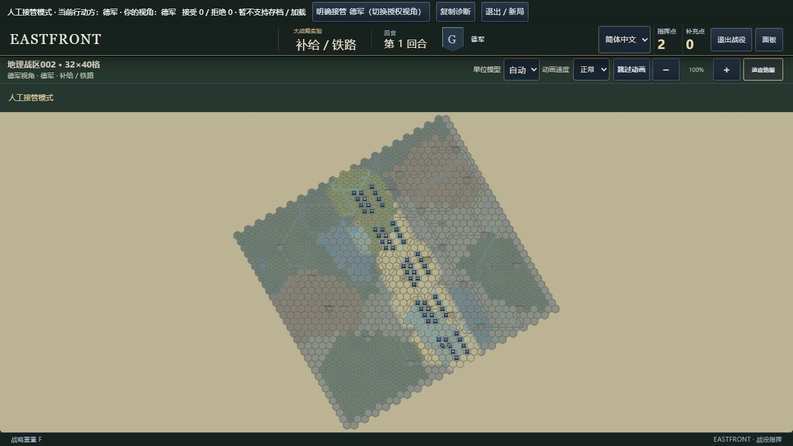
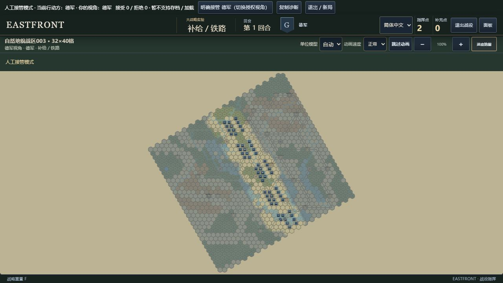
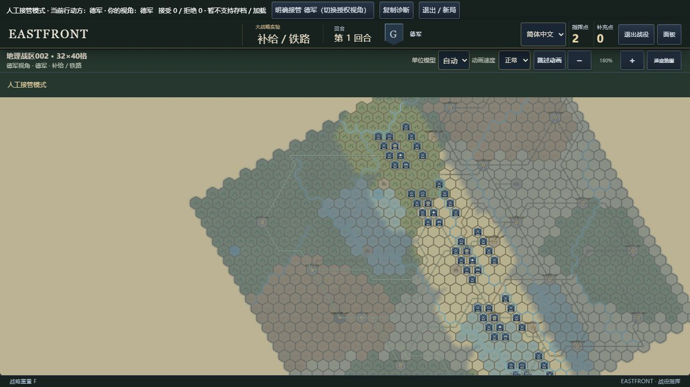
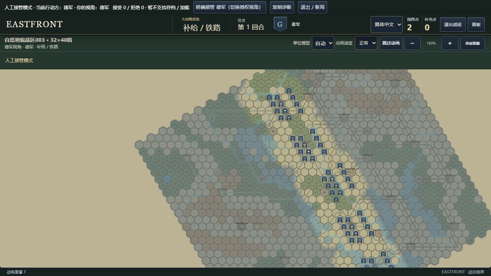
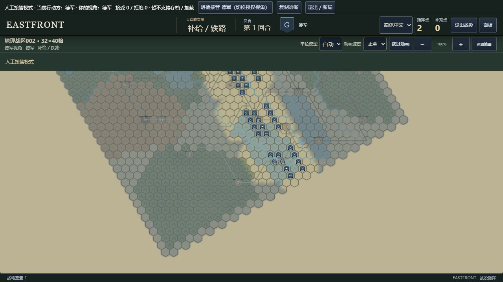
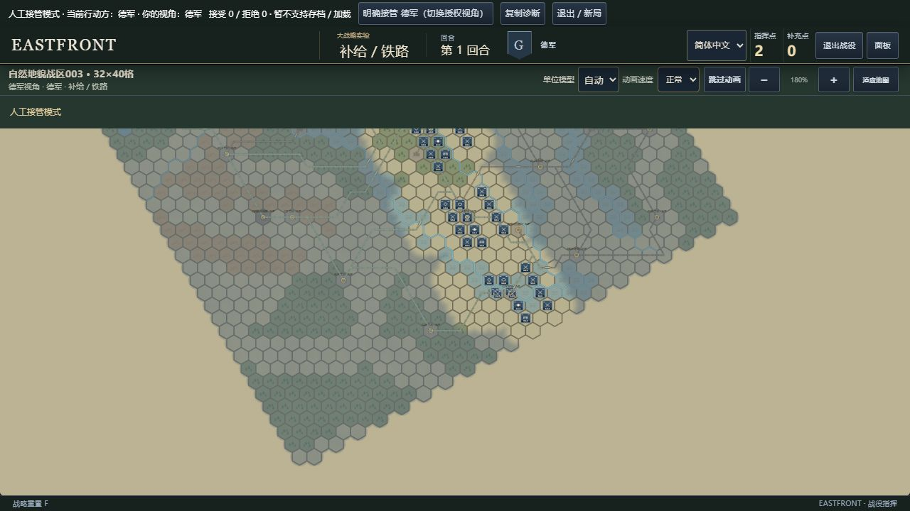

# GRAND-CAMPAIGN-003 · 自然地貌可玩候选

基线 `023a81e6dd83b2c465343247a729fe653cff2767`；分支 `grand-campaign-003-terrain-naturalization`。

本机入口：<http://127.0.0.1:4193/>，默认“自然地貌战区003”。002最终版对照在4191。4192已被其他进程占用，本任务未停止它。服务仅监听127.0.0.1，未部署。

## 变化与玩法

- 北部连片森林加入聚落开阔地、林湖间通路、前线林间走廊，保留舌状林带及中部附属林块。X6—W6—W7由森林改为真实平原：步兵两格耗2移动点、0.5补给点。
- 西部及东北丘陵变为主脊、支脉和相连谷地，保留可用的入口/出口。林地掩护与开阔地速度的效果仍由原Core地形规则决定。
- 湿地限定在选定河谷低岸和乌拉湖岸低地，南部渡口附近穿插高岸干地。河障和桥不变，干地不等于免费跨主河。
- 中央保留主要开阔区，增加相接的河间林块；西南、东南大林区内部有弯曲谷地。没有逐格随机散点或地形占比配额。

统一修改主地形，显示沿用原SVG符号、美术与FOW，没有第二张常驻地图、概念图覆盖、加载器重写或新素材包。

## 最终实机对照

全部本轮重新拍摄，002为最终323河边/18桥版本，非旧10张截图。1280×720，双方均T1德军补给/铁路阶段、德军授权视角、未行动、面板收起，无FOW关闭。

|镜头|002最终水系|003最终运行版|
|---|---|---|
|全图，100%，平移0/0|||
|林区/丘陵，180%，平移185/45|||
|南部湿地，180%，平移−75/−240|||

`camera-comparison.json`保存相同SVG viewBox、局部变换和授权视角；`browser-summary.json`保存截图和运行源码哈希及拍摄条件。

## 简短操作

开始→结束德军补给/铁路阶段→本方部队定位选G-003→定位并选择→开始移动→W6→W7→确认。Core坐标为X6(23,-6)→W6(22,-6)→W7(22,-5)。可以自行选择其他林缘/谷地路线。

结束双方各阶段，换方时在顶部明确接管并确认。苏军掘壕结束触发E1；G-003移动后3.5点，维护扣1点，收到3.5点补充，最终6点/欠账0。浏览器完成11笔真实权威行动，无检查点注入或免费物资。

## 仍显块状的地方

西南出图边界仍有大块连续林地，东北两条脊线在远景仍像宽条带；10公里主地形格与既有粗六角边界仍有阶梯感，FOW灰幕会压低差异。实心块状已减少，但不是用户视觉认可，也不证明平衡。五组近等距设施的人工感保留，不顺带改经济/部署。

## 参考

沿用002白俄罗斯中东部连续参考窗（26.6–32.1E、52.5–55.35N，约10公里/格），明确为东欧地理启发的原创战区，非1941复原。本轮重新查看本地GMT Map C和WiTE2地形页，借鉴林地内部开口、聚落交通联系、主地形与格边河障分离；不描摹商业图。沿用Natural Earth实际裁剪水系约束湿地，UNESCO Berezinsky林地—泥炭低地关系作定性参考。未新增DEM/植被像素或声称核验局部高程。详见[002来源和许可](../grand-campaign-002/REFERENCES.md)。

## 验证与回退

[9组定向核验](VALIDATION.md)通过，[整合清单](INTEGRATION.md)包含逐格差异位置。复用原经济事务，未重跑全套及24回合。首页选002即可回退地图，001及640格入口保留；源码回退为固定父提交，不覆盖其他worker。
