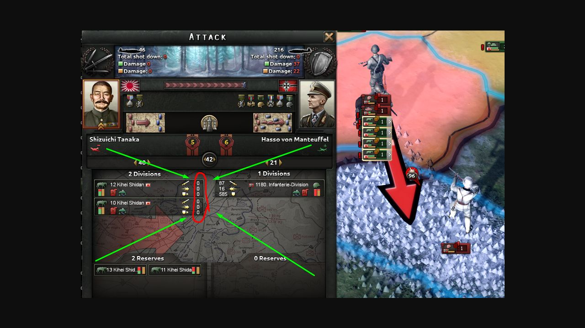
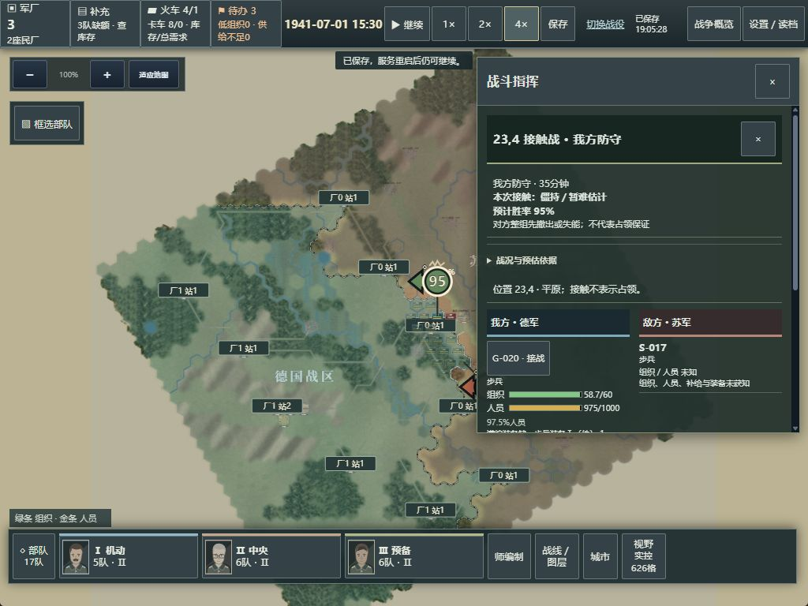

# GRAND-DIVISION-003 集中交付记录

本轮仅本机候选，未部署。基线线上只读核对为 `ba44cd1b5f2ceea4408a9b63a9d31854543c44cd`，继承证据提交 `d05a2f8ceb0129927d28058d012133260918021e`。分支 `grand-division-003-combined-arms`。具体参数及授权来源见 [DECISIONS.md](DECISIONS.md)。不宣称复刻原版引擎。

> 运行状态：4273候选仍运行本轮早期后端，浏览器已加载生产面板等前端修复。最终后端的燃料、伤亡欠扣与零组织处理尚待仅重启本进程后载入。停止该进程的首次工具操作遭自动审批拒绝（未给具体原因）；已请求仅重启4273，未收到答复前不绕过。本说明不把运行中的旧进程称为最终代码。

## 怎么玩

统一入口 `http://127.0.0.1:4273/campaigns`，选择“多兵种编制候选”。旧两种战役继续使用原引擎、原目录；新模式为 `division-003`，不会自动转换旧局。

1. 正常新局经验0。让部队实际接战取得经验；每个有本方实际交战的游戏小时最多1点。
2. 点“师编制”，点空团槽位添加炮兵、摩托或轻坦；每列只放同类别。正式保存按最终差异营槽5点、支援槽10点收费；草案免费。
3. “部队换编”选择脱战、无在途移动且后方连通的部队。确认三态预览，再换编；人员、部队ID、军团及命令保留，缺额不会免费补齐。
4. 顶部“军厂”中释放/分配工厂给火炮、卡车、LT-0或燃料。完整件入库，日常供给后剩余运力自动运输。摩托与轻坦还须有燃料；国家库存不等于部队已收到。
5. 按原地图方式直接下令或恢复军团计划。离开前保存。恢复存档默认暂停。

初始双方各18队、每队一营步兵，国家备装0、人力4800；每方明确初始化4列车、8辆后勤卡车。不是历史战斗序列。卡车分配给枢纽后不能再补入部队，释放后才可重新分配。携行燃料随实有车辆限制为12小时：换编缩减携行上限时仅该队多余燃料退池；战损失去载具后超出携行能力的油计损失，不从前线免费传回国家池。

## 实际链路与取舍

- **浏览器正常局，无注入**：自然接敌至7月1日15:30，获得6经验；一队在交战中损失，未制造胜利。保存步炮模板支付5经验，G-013换编后1000/1500人、0/24炮，软攻4、防御14.67、组织上限30；原步兵齐装为软攻6、防御22、组织60。按现行人员比例分摊，未补足时步兵贡献也暂降，预览已说明。
- 浏览器从步枪线释放1厂，分配给火炮线，真实效率降至10%、显示0.3件/日；保存并重连仍保留模板、经验、缺额、生产配置。截图 `browser/03-real-adoption.jpg`、`04-production.jpg`。
- **自动代理正常战役，不是真人体验**：同一默认种子两份事先固定操作方案。第一份撤出过晚，目标部队损失，失败记录保留于 `normal/`。第二份从开局布防并撤回三队改装，30日预算内炮与卡车真实到货，坦克生产因指定工厂失守受损而停止，未认定终局，也未修改状态补货。
- `defended/` 同一自然存档继续：改配剩余两厂生产坦克和燃料。第9644步（第33.49天）坦克与燃料首次同在部队；第9725步实际完成新路段。最终代码从真实第9644步存档复核：到达后这1辆坦克仍在、人员1500不变，保存恢复一致（`final-checkpoint.json`）。炮兵部队有16门真实战损，之后补回24门。并非所有部队已满编，资源与工期仍是约束。
- 最终代码复用该真实中期存档，在HTTP/WS测试中将G-013缩回原步兵：500人、24门炮原子返还，步枪实际32件原样保留。重复请求不重复退库；继续12步燃料真实产出，再保存、关闭服务、重启、恢复。两种旧模式与访客文件保留，旧连接代次拒绝。见 `integration.json`。

## 固定差异检查

以下满编、满燃料数值来自定向属性/结算检查，**不是正常战役中的免费资源**。详见 `comparisons.json`。

| 编制/条件 | 软攻 | 防御 | 组织上限 | 速度 km/h |
|---|---:|---:|---:|---:|
| 一步兵营 | 6 | 22 | 60 | 3 |
| 步兵＋炮兵齐装 | 32 | 33 | 30 | 3 |
| 一摩托营齐装有油 | 6 | 22 | 60 | 9 |
| 摩托17/35辆车 | 2.91 | 10.69 | 60 | 5.91 |
| 摩托齐装无油 | 6 | 22 | 60 | 3（突破8→3） |
| 一轻坦营齐装有油 | 10 | 2.4 | 10 | 4.455 |
| 轻坦齐装无油 | 2.5 | 2.4 | 10 | 0（不开始行军） |

LT-0设备突破16.675再应用轻坦营15%修正，为满营19.17625；不是额外赠送倍率。新模式另修复缺装期间产生整件伤亡欠账后扣掉未来到货的问题：只保存小数损耗，现有件数为0时清除此型号损耗余数；读取本分支早期检查点时不再追扣整件欠账，旧战役不变。纯炮兵组织上限为文件值0，不会通过通用休整凭空获得100组织条；应与有组织度的营混编。硬度、部分穿甲、地形修正与宽度按批准表统一双方结算，随机数仍只由原种子生成。

测试覆盖：整数生产/小数工作量、车辆唯一占用、跨周期单件预留、断路取消退库、正式费用、失败回滚、重试、存档隔离、燃料守恒、零组织上限、敌方缺油时真实改厂（连续两次判断、每天最多一厂）。旧模式48步相同动作的状态、经济和RNG对照通过；未重跑整套平衡。

## 气泡参考与实际画面

实际查看 [Paradox论坛原始实机图](https://forumcontent.paradoxplaza.com/public/1036143/cavalry%20bleed.png) 的像素，保留浏览器截图 `browser/reference-view.jpg`，未导入游戏素材。未观看新的动态视频，不启动原版游戏。

| 参考观察 | 当前运行界面 |
|---|---|
| 红色宽攻击箭头、深描边，落在交战处 | 复用真实红攻击、蓝支援、绿色进度箭头；来源/落点仍为授权行动 |
| 紧凑圆角交战徽标，数字在中央，黑色轮廓与交火尖齿 | 原创SVG黑轮廓圆形数字与方向翼、顶部短尖齿；大小有屏幕像素约束，透明热区≥44px |
| 红色箭头与气泡数字构成独立信息 | 动作颜色与气泡态势颜色独立；面板分别显示时间估计与数字 |
| 参考数字96不能据截图断言内部公式 | 本游戏数字使用已公开10点区间交战趋势，25×25比较、取整至5%，未经校准；新兵种不读取敌方精确装甲/装备，缺连续趋势显示“—” |

| 参考浏览器实图 | 本候选真实交战 |
|---|---|
|  |  |

本轮实际点击同一23,4战斗入口，数字95、双方参战详情与组织人员条正确打开，敌方精确状态仍未知。正常片段也出现5；不按交战时长自动增加。估计可能与“尚无有限整组结束时间”同时出现，二者不是同一指标。没有证明已达到钢四视觉效果或概率准确度；平板真机/原生多指触控仍未验。`05-battle-current.jpg`为1024×768桌面浏览器视口截图。

## 性能与剩余边界

同一Windows机器、默认种子、48个准备步，分别16秒本地权威/协议探针（不含渲染、网络或平板）。002→003：1×步耗时中位40.13→43.06ms，p95 60.15→55.44ms；4×中位50.80→54.24ms，p95 57.68→61.36ms。各窗口1×推进7步、4×30步；命令p95分别9.75→6.14ms、6.70→5.99ms，暂停6.40→5.80ms、5.92→5.92ms。短样本不能推导公网提速或平板流畅。完整原始记录见 `performance.json`；新计算有小幅成本，未削弱AI或跳过结算。此轮单独运行；早先与检查重叠的采样单列为 `performance-concurrent-checks.json`，不用于比较。

敌方能付经验换编、用真实生产补充，缺油时优先安排燃料。首次长记录暴露“先大量造坦克却没造油”，已修正无油时的生产排序；最终排序另有定向验证；最终代码从第30天续跑的同方案失败，G-017在运输到达前消灭，完整失败保留于`final-continuation/`。第9644步已生产到货的真实旧检查点续跑用于单独验证新机动/欠扣修复，不把它当最终新局全流程。**未把修改前的整场记录冒称最终策略全局结果**。没有专门坦克突破战术或围歼策略，不宣称敌方擅长合成作战。

仍未接入：坦克设计器、装甲型号升级、燃料炼制产业链、贸易、完整科技树、工兵壕沟/渡河特色、侦察战术加成、原版训练倍率。已有兵种文件事实不等于原版聚合/解锁行为已核验。既有军团职责、轮换、手动优先沿用。

## 保存、关闭和回退

本机存档：`%LOCALAPPDATA%/Eastfront/grand-division-003/visitors/<访客ID>/division-003/campaign.json`，原子保存及备份沿用。不要清除Cookie。真实中期检查点在 `evidence/grand-division-003/final-checkpoint.json.gz`，不会自动载入或覆盖网页战役。

候选构建：`node experiments/grand-release-002/build.mjs`。本机启动/状态/关闭：`powershell -File experiments/grand-division-003/local.ps1 start|status|stop`（三选一）。关闭前网页保存；脚本只核对并停止4273候选PID，不批量结束Node。

兼容回退：本候选设置 `RELEASE_COMBINED_ENABLED=0` 后重启，仅关闭新模式入口，保存文件不删；原战役、步兵先行仍可进入。不要把`division-003`文件交旧引擎读取。当前公网、本机其他旧服务与旧存档完全不改。
