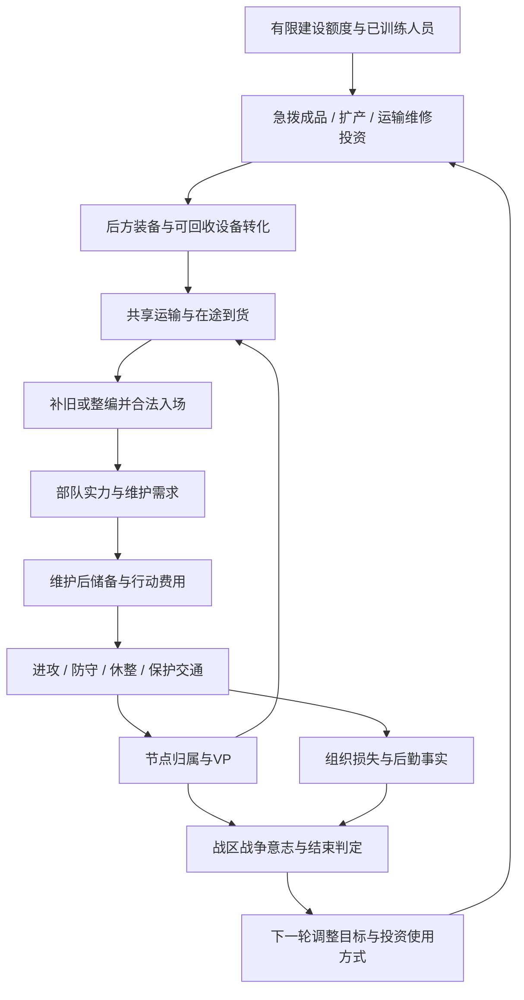

# RULE-CAMPAIGN-001｜24回合大战役闭环设计

2026-10-02。**设计整合报告；不实现规则、不改Core或地图、不部署。**

**结论：这些系统能构成有条件成立的战略循环，但尚不能认定已形成合理、平衡、可运行的24回合大战役。** 工业002已证明账本上的机会成本，胜利024提供了目标和退出机制；缺失的是统一的24完整回合时序、真实地点价值、供需基线及合法行动到胜负的验证。

推荐保留“突破—消耗—决战”三个规划窗口，采用胜利024的C模型作为设计目标。初期实现时先记录战争意志，不让尚未校准的压力自动结束对局；正式启用提前结束须另过校准门槛，不能悄悄把影子观察说成C模型已通过。

## 0. 版本与证据边界

|依据|固定版本/性质|本轮采用什么|
|---|---|---|
|SCALE-INTEGRATION-001|本聊天设计；本次用户明确24回合方向|约10公里/邻格中心距、约1周/完整回合；24回合为候选，非现行运行值|
|RULE-VICTORY-024|`09bc1bde826b5b1ce6b6d84e084e12c392bdcca5`|24完整回合、E24边界、VP＋战区战争意志；全部阈值仍是假设|
|INDUSTRY-EXP-002|`31ec97e40ce78037ec62008649e5f39674753446`|同起点A扩军/B工业/C运输维修与D不投资对照；局部单走廊账本，不是真实地图对局|
|INDUSTRY-DESIGN-001|`c4602bc8d5fd8b88dcd7db883a49f26d2d332387`|建设额度、人员、装备、SP分账；抽象后方；非全国经济|
|SUPPLY运行与UX|主体基线`813b4072568352e95d0726fe5fe04060c889c554`；UX证据`a06737e95e40acdb79580e6b2fe32a9aaba2d2e4`|实际库存、维护、欠账、逐单位攻击支付与只读预览；不因本报告改变来源/参数|
|RULE-SCALE-022|`b8b2c50a48eb12f570151a632bf5bf9907dfbbf0`|师级主力与旅/支援单位的明确语义；两步旅等仍未自动成为当前模板|

除标明“现状”的源码事实、固定提交和引用实验结果外，本报告所有数值、时序、公式适用方式、阶段和验收门槛均为**设计假设D**。引用的002结果也由实验假设产生，不是战果或平衡值。没有新增24回合模拟，没有重跑既有全量检查，也没有重新计算002路线。

独立分支`rule-campaign-001`从胜利024提交创建；其他研究只读引用、不合并。适用祖先与仓库未发现AGENTS.md、PROJECT_STATE、WORKER_PROTOCOL，不重建管理文件。上一份尺度答复曾推荐16回合，本轮明确按用户最新24回合方向设计。

## 1. 24回合结构：合理的规划窗口，不是三段强制剧情

|窗口|玩家主要目标|工业与补给的角色|应保留的选择|需要观察的结果|
|---|---|---|---|---|
|T1—T8 突破|进攻方选择主轴、争取节点和纵深；防守方保存主力、守交通与恢复通路|初始储备换行动窗口；急拨装备早到，工业投资晚到；运输项目先保既有部队|抢点或休整、集中或留预备队、急拨或扩产、修路或保持工程力量|首批新增部队何时合法入场；节点控制能否维持；是否已消耗未来维护储备|
|T9—T16 消耗|把局部突破转成可持续阵地；救出被隔断部队；轮换整补与反攻|早期工业出现累计交付收益；人员、队列、SP来源和共享运力开始限制扩军|补旧或新编、再进攻或轮换、继续产某类装备或减少无效发运|装备是否真正到基地；维护满足之外是否仍有攻击库存；收复运输线是否改善实际回执|
|T17—T24 决战|争取最终VP结构，保护已有成果；必要时保平或有序撤退|后期投资看剩余可用窗口；优先解决当前瓶颈，避免把预算锁进战后才到的货|守高价值节点或救主力、终局抢点或截断补给、短维修或晚扩产|目标确认归属、两轮崩溃预警能否解除、最后双方行动和E24是否完整结算|

阶段边界**不重置库存、欠账、战争意志、项目或AI计划，也不突然增加VP或伤害**。T6可能已经进入消耗，T20也可能仍在突破；这些名称是教学和复盘视角。约半年可能跨季节，但没有起始日期与天气实现，不能把某一窗口直接规定为泥泞或冬季。

当前地图640格是否支撑约半年的纵深争夺仍未验证；不能因回合变多就默认有更多有意义空间。现有定时增援只到T15，RP也不是周期性收入：不自动在T17发援军或重置恢复预算。后续须在同一资源账下比较延长战役后的缺兵、人员枯竭及战线容量。

## 2. 完整循环与阻断点

图中回路是**决策反馈与资产可用性反馈**，不是VP自动生成建设额度。没有新增全国税收、自动I收入或凭空人员恢复；002只有开局有限拨付，第一笔钱花完后仍能选择装备用途、队列、休整与路线，不能把“每轮工业决策”包装成“每轮都能再建厂”。

必须分清六个量：

1. **装备库存不直接增加维护。** 真正新增在场部队才持续增加B；只生产不新编会占仓/运力，但不会凭空多出一个师的口粮。
2. **补旧不等于新编。** 现行维护按类型、不随伤阶下降；修一阶通常不增加该单位B，新编新增整份B。修复仍有材料/人员、合法位置、休整和每轮名额成本，不总是无条件最优。
3. **设备回收不等于立即修复单位。** 必须有真实可回收残骸和处理能力，不返还人员、不增加Core恢复名额、不允许故意反复伤损套利。
4. **装备不是SP。** 1SP=4内部库存单位；弹药/燃料等消耗性补给独立于成品装备。运输共用预算，工业生产不自动增加SP来源。
5. **攻值与攻击机会不是VP。** 合法目标、位置、CRT、敌反应和节点保持时间决定有没有战略收益；联攻的多个单位不能当作多场战斗。
6. **战争意志不是另一层战斗减效。** 沿用024，仅作为战区预警与提前退出；不降低生产或战斗数值，不形成“低意志再减产”的新恶性循环。

失去地图内真实生产资产可以影响其生产资格；失去地图外工厂的前线入口主要影响到货，不能直接把全国工厂判为敌占。地点多重角色只算一份VP和一项地点压力，但供应链被切断的实际后果仍存在。

## 3. 每轮玩家应作哪些决定

建议一轮呈现为“复盘实际回执—决定本轮目标—承诺行动与休整—按现有阶段执行—完整边界结算”。这是交互/规划顺序，不是新增Core阶段。

|决策|应提供的本方已知信息|值得做的条件|应停止或换方案的信号|
|---|---|---|---|
|继续进攻？|每个参攻者费用、行动后储备、实际有效系数；已知目标VP及确认条件|能取得/拒止有意义节点，且收益足以承担组织损失和后续补给风险|只是增加攻击次数而不改变战局；下一轮维护/后撤无保障；为虚假满效预览孤注一掷|
|暂停整补？|当前欠账、已到装备和P、恢复资格、下一次配送时点|休整能使一支关键部队恢复组织或等待真实交付，保留再攻能力|供给来源长期不足、入口仍堵；单纯结束回合不会凭空到货|
|投工业或使用已有产出？|未花I、施工/在途/整编期、仓容、到货后可用回合|后方安全、真实需求和运输/SP/P/队列均有可用空间|钱已用完、无人员、成品积压、到货晚于可利用窗口|
|新编还是补旧？|新增B与长期SP需求；补旧休整及恢复名额|需要新的正面/守点单位且能养得起，或旧部队修复更快投入|满仓装备掩盖SP缺口；新师挤占主力库存；只为稀释战争意志损失比例而编空壳|
|保护/恢复铁路？|本方实际维护缺口、已知通路、维修计划与工兵机会成本|确认是运输或可达性瓶颈，接通能服务真实来源与需求|来源已经是瓶颈；扩运只会多空容量；修路被误当成立即补仓|
|争夺哪个VP节点？|公开分值、归属确认状态、已知防守与本方可持续能力|改变终局结构、解除后勤瓶颈或保存纵深|同一节点被重复算城市/工厂/枢纽价值；仅为低价值点丢掉主力与主通路|

玩家可主动安排行动、合法休整、修路及未来工业订单，但**当前补给分配是自动的**，不宣称已有“手动把物资优先给某师”的控件。界面不能通过预测暴露隐藏敌军阻断，也不能承诺未来一定到货。

两种不同暂停应明确：①等待维护恢复债务；②有维护但没攻击储备，减少本轮消耗以形成库存。D=0并不保证下一击满效；库存0也不表示失去攻击资格。

## 4. 工业002提供了什么证据

以下直接摘录固定提交的`SENSITIVITY.json`，没有在本轮重新模拟。A急拨、B工业、C运输/维修均支出12I；D同起点保留12I不投资。24轮样例仍采用旧终局口径，**只有E1—E23**；固定外生战损、全步兵、单走廊、假定合法目标/恢复位置，未接VP和战争意志。

|002默认后勤long24|A急拨|B工业|C运输/维修|D不投资|
|---|---:|---:|---:|---:|
|期末单位|19|20|18|15|
|期末成品装备E|3|24|4.5|3|
|剩余P|5|2|8|17|
|满效单位攻击机会|53|67|158|143|
|减效单位攻击机会|274|274|122|104|
|辅助攻值累计|1238|1180|1263|1108|
|维护欠额/补给损耗|0/0|0/0|0/0|0/0|
|期末SP|0|0|0|0|

能得出的结论：

- **工业不是永远最佳。** B比A多一个期末单位，却积压24E、攻值代理更低；不能凭产量判赢。A已有更早行动窗口；D保留未使用预算，不能只用攻值较低就说其策略被淘汰。
- **C也不是永动最优。** 主16轮C没有减效机会，但默认24轮已有122次减效机会、期末SP为0。运输/维修无法创造来源；不能把16轮内由初始储备支持的好表现外推到长期。
- **维护满足不等于进攻充足。** 四路都无欠额/耗损，却都有减效攻击。按024缺供压力定义，这些账本不能仅凭空仓就触发长期缺供压力；而其外生损失也不是实际战果，不能直接宣布战争意志为某值。
- 充足后勤反事实`long24_ample`中，A/B满效机会327/363、攻值1610/1776，B后期更强；但B已耗尽60P、只修18阶，A修22阶。产能成功以后仍会碰到人员/恢复约束。40SP来源、44负载是反事实，不是本轮建议改的参数。
- 极低来源`very_low_source`下，B与D同为3个期末单位、攻值328，工业没有行动代理收益；仅运输对照又显示增加库存未必增加攻击机会。路线优势是条件性的。

这支持进入统一场景设计，**不支持直接把C的1263或B的1776换成胜率/VP**。同一战术位置、敌反应、回收控制权、机械化费用和多枢纽约束尚未比较。

## 5. 必须统一的每轮时间合同

沿用024：T包含德国全部阶段和苏联全部阶段；E_t在苏军末、所有战斗待决完成后。未来大回合只结算一次：

1. 本轮行动、修路、恢复、工业订单按其合法窗口提交；只有此前实际到达的装备能在本轮阶段消费，不能借E_t尚未到的货先修复。
2. 在候选副本中冻结地点变化；工业施工、产出、在途与共同运输预算依统一版本处理。
3. 补给配送、维护、欠账、耗损回写Core；随后取同一状态更新VP、战争意志与连续崩溃计数。
4. 若结束则输出结果；否则进入T(t+1)。边界原子提交、幂等、防重复；保留既有3秒预算。不是再跑一遍优化器来“算战争意志”。

### 5.1 两份研究不能直接相加的地方

|衔接冲突|本报告推荐解决方向（设计，未实现）|
|---|---|
|002的H24只有E23，024要求E24|新大战役以E24为最终事实边界，双方T24均可行动；原工业统计保留旧口径，不能直接贴“24完整回合已验证”标签|
|002新编在完成E即付维护，并假定下轮已入场；024兵力分母只计实际部署|明确分开后方整编完成、等待入口、真实入场。只有实际在场部队进入前线补给及VP/W兵力账；后方候补不是免费永存军队，其P/装备和预算承诺继续保留。候补维护如何包含在后方订单预算须另定统一合同，不能暗称已由前线B覆盖，也不默认为零成本|
|002最后回合不维修，因为不增加下一次进攻；新胜利与德苏轮序不同|不把账本策略变成规则禁令。T24德国合法恢复仍可能影响苏军进攻时的防御；双方合法恢复也可影响E24组织损失压力。只要费用、休整、资格真实满足，就可计入，不能一刀切“末轮维修无用”|
|E24才到的装备/完成的新编没有T25|存为后方/待入场/在途结果，不折VP、不虚构部署、不放进已投入部队分母稀释F；E24物资不能追溯消费于T24恢复阶段|
|E24配送能解除缺供，额外工业货运可能挤占它|终局物流仍执行与此前相同的预算规则并显示影响；不得为了好看只补给不记维护，或临时给终局货运免费额度。玩家应能预先知道没有T25利用价值的发货会占用什么|
|022旅级/两步语义与002全三阶步兵账本不同|组织权重、装备配方、恢复档、B和行动费用分别映射；不能统一“1棋子=1师=3P/3E”迁移到全部兵种|

其中新编部署/后方候补维护是**需要后续评审的接缝**，不是本报告已解决的实现。跨部门合并前先冻结一个事件顺序和版本，再重算联合账本；不要求重做所有研究。

### 5.2 后期投资窗口示例

只用于解释时间：延用002候选工业项目12I、施工3个E、其后每E多2E、运输L=1；假设有未花I、材料/队列/运力，不受敌方干扰。若T_s下单，则首批额外产出E_(s+3)、首批可用T_(s+4)；累计额外12E的数量替代价值最快T_(s+9)。不是退还12I，更不是实战回本。

|下单|首批额外装备可用|累计12E最快可用|战略含义|
|---|---|---|---|
|T1|T5|T10|可支撑消耗与决战窗口，但前期放弃急拨|
|T9|T13|T18|可能服务后期，需要前线撑住且真实瓶颈是装备|
|T15|T19|T24|数量回本很晚；新编、赶路与目标确认可能来不及|
|T16|T20|T25，战役之外|不能承诺战役内数量回本；部分早到装备仍可能有价值，不能直接说绝对禁建|

L=3会把上述可用时点再推迟两轮。得到装备后还要付人员、占恢复/整编名额，并完成合法入场与行军；024要求连续两个E确认目标，因此T24新到目标最多拒止旧方得分，不能直接获得新方确认分。所有窗口以“有条件最早”为标签，不保证未来配送。

## 6. VP是否鼓励合理战略

继续采用024设计：`V_s=0.7×终局确认VP + 0.3×24轮平均确认VP`；首都只是一个目标组，多重角色不重复计分；战争意志不再转换成VP，歼敌和库存没有附赠VP。

一个10VP目标若从E1到E24持续确认归属，贡献10分；若只在E23、E24确认归属，贡献7.25分；若仅E24首次占领未确认，己方贡献0。若目标从一方的终局确认归属转为另一方，单是终局项就会使双方差值摆动14分。这是公式算术，显示末期争夺重要，也揭示**早期控制的独立奖励较弱，末轮拒止仍可能过强**。不能把70/30当作已证明的正确激励。

合理战略应出现这些取舍：

- 铁路节点即使VP不最高，也可能让多个现有部队恢复行动，支持下轮争夺主目标。
- 保存主力、退到可补给纵深，可以暂失VP换反攻能力；若固定源不足导致退到哪里都失败，这个选择就是假的。
- 防守关键地点可赢，但不能靠完全退出交战区、让对手没有合理赶路时间就稳定守分。初始VP偏苏方与苏方最后行动优势需单独校准。
- 歼敌没有直接VP，但可降低敌方继续作战能力；不能鼓励为了损失分而无意义追杀小单位。
- 战区W的失地/损失/长期缺供应推动救援和恢复，而非为了降低损失比例在终局空造单位。只计实际投入的永久ID，并保留已消灭ID损失。

因目标坐标与初始owner尚未冻结，**目前只能说VP方向合理，不能确认它在现有640格上奖励正确路线**。下一轮必须同起点比较“直奔高分点、先保物流再抢点、保军撤退反攻”；不在本轮调整70/30或10VP例值。

## 7. 最大风险与能否形成选择的判据

|风险|现有证据/机制|下一步必须区分什么|
|---|---|---|
|**最大：固定缺供造成自动失败**|真实实验开局维护德33SP/苏38SP，对各24SP来源；024又将持续缺供和耗损纳入退出压力|无敌阻断、停止额外进攻的对照是否仍被迫崩溃；撤回合法供给区、减少消耗是否真的延缓/解除危险；不能靠淘汰己方单位来称为平衡|
|工业永远最佳或完全无用|002已分别给出后勤充足、源不足和库存积压反例|要比较生产→到货→可用组织→合法行动→目标保持全过程，不只比产量；不因一个反例就全局删工业|
|运输/维修成为固定最优|C在局部账本表现好，但初始储备、全步兵、残骸安全回收均有利|来源不足、无可回收设备、恢复名额满、不同位置与混合部队下是否仍有收益；不得靠提高来源为其保收益|
|失节点连锁失败|同一节点可导致失VP、地点压力、物流中断、耗损、兵力压力|虽非同一项重复计账，仍可能形成陡峭滚雪球。W不再减战力只是限制，不等于已有足够恢复窗口|
|守分/末轮抢点压过长期战略|70%终局权重、确认窗口与先后手|中期工业和持续守路能否真正改变结果；E24拒止是否比长期经营更容易获利；公开分数不能泄露隐藏库存|
|虚假的24轮闭环|002/E23、024/E24、工业候补、新单位前线维护不同口径；实际Core仍旧终局|先把同一个状态事件顺序写清，再运行合法场景；不能仅把两个报告的数据拼成“系统通过”|

“有意义的选择”不要求三条路线每个指标相同，也不要求胜率各三分之一；要求在**同起点、同信息、同资源预算、相同敌方压力**下，至少有不同瓶颈能让不同决策获得可解释的行动/目标收益，且玩家能从授权反馈识别条件。D不投资必须保留，其未花预算不凭空转换为SP。

若无敌方干扰也必然因基础维护缺口崩溃，或者唯一稳定策略是放弃新增系统、被动等失败，就不应上线正式C模型。后续应提交明确的场景预算/目标评审，而非暗调供应量、禁用损耗、免除W或放宽超时来让测试通过。

## 8. 下一步实现拆分与停止条件

|顺序|任务输出|通过条件/停止条件|
|---|---|---|
|1 场景合同|冻结24完整回合边界、现有格位目标清单、initialOwner/homeSide、混合编制映射、开局和既定增援预算|缺实际工业资产就标接口未启用；无候补维护/入场合同就不并入工业新编|
|2 联合账本对齐|将002的同起点路线换成统一E24、双方行动口径；保留不投资、源不足、运力不足、材料不足对照|明确新编进入R/B的唯一时点、最后回合合法修复、终局未用货；只重算相关账本，不重跑无关全量测试|
|3 胜利影子评估|只读记录公开VP、本方W、崩溃预警，先不改真实终局；输出同事实下A固定截止/C提前退出的差异|固定源缺口主导结局则停止启用提前退出；记录失败而非自动调参|
|4 小量合法战役分支|复用现有合法早中期检查点，比较已支持的进攻/整补、修路/争点；补旧/工业新编及T17以后窗口在第5步对应接口实现后补验|真实来源、共享桥/枢纽、行动资格、敌反应一致；未实现的工业选择只保留账本比较，不使用不存在的命令伪造合法动作|
|5 接入新局规则版本|24终局、工业订单/库存接口、只读决策预览、同一原子边界与授权投影|RNG不额外推进，失败回滚全部账、重复ID不重复产出/得分，既有3秒及资源边界保留；旧局不静默迁移|
|6 AI和有限场景校准|AI以合法目标变化、持续能力、剩余窗口优化；检查地图纵深、后半程增援/人员枯竭及先后手偏差|人机同授权信息；既不能用攻值代理冒充胜率，也不能为三个阶段新增强制行为；测试范围另行批准|

本轮完成的是设计判断与衔接清单，不实施上述步骤。AI、多人与存档能力依各自实际版本另验，不能因报告闭环而宣布这些接口已接通。

## 9. 交付结论与来源

**推荐结构成立：前期用储备和急拨争窗口，中期用到货、维修和运输维持战力，末期把剩余能力转成可保持的战略地点；VP与战区W提供目标和退出压力。** 但装备、SP、空间与时间均可能阻断这条链，因而正确结论是“可进入统一合同与小量合法分支验证”，不是“24回合已平衡”。

首要后续工作是统一E24及新编入场合同，并证明固定来源不足不会把合理整补策略也变成自动失败；随后才讨论具体目标分值与正式提前结束。

- [工业002报告](https://github.com/jnmbys/eastfront-web-preview/blob/31ec97e40ce78037ec62008649e5f39674753446/docs/industry-exp-002/REPORT.md)、[方法](https://github.com/jnmbys/eastfront-web-preview/blob/31ec97e40ce78037ec62008649e5f39674753446/docs/industry-exp-002/METHOD.md)、[条件实验数据](https://github.com/jnmbys/eastfront-web-preview/blob/31ec97e40ce78037ec62008649e5f39674753446/docs/industry-exp-002/SENSITIVITY.json)。
- [胜利024](https://github.com/jnmbys/eastfront-web-preview/blob/09bc1bde826b5b1ce6b6d84e084e12c392bdcca5/docs/rule-victory-024/REPORT.md)、[022编制尺度](https://github.com/jnmbys/eastfront-web-preview/blob/b8b2c50a48eb12f570151a632bf5bf9907dfbbf0/docs/rule-scale-022/SCALE.md)。
- [工业001](https://github.com/jnmbys/eastfront-web-preview/blob/c4602bc8d5fd8b88dcd7db883a49f26d2d332387/docs/industry-design-001/DESIGN.md)、[补给019](https://github.com/jnmbys/eastfront-web-preview/blob/b4a30a7c6958db1246a8c031850c4f936d1ceb61/experiments/supply-rules-019/PLAYER_GUIDE019.md)。
- [当前阶段顺序](https://github.com/jnmbys/eastfront-web-preview/blob/813b4072568352e95d0726fe5fe04060c889c554/core/source/src/rules/turn.ts)、[015权威与事务契约](https://github.com/jnmbys/eastfront-web-preview/blob/813b4072568352e95d0726fe5fe04060c889c554/experiments/supply-integrate-015/CONTRACT015.md)。
- 本目录`EVIDENCE.json`保存只读来源哈希、所引002字段摘录、窗口/VP精确算术和未验证项；没有新增运行代码或对局证据。本报告不追加历史史实或外部游戏结论。
