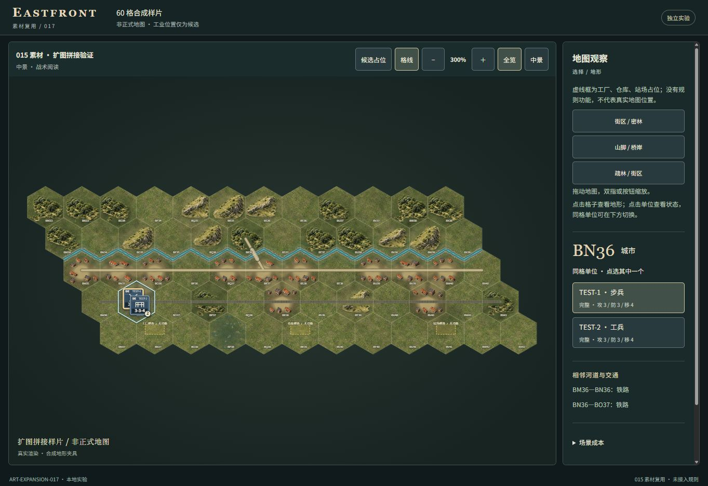
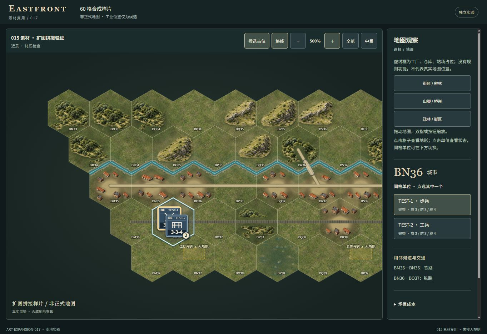

# ART-EXPANSION-017 验证结果

结论：现有美术可复用于独立小场景及不同坐标/格数的布局输入，足以延续015方向；
尚不能直接认定其支持任意大地图。明显限制是山形重复、通用河岸折线、固定净空和
最长边4096的单画布。此次只完成一个60格候选，没有扩正式地图、部署或追加精修。

## 真实渲染截图

全部来自本地浏览器实际Canvas/SVG，不是概念图或测试替身；1363×936，选中TEST-1。
三分区300%采用同一世界单位缩放，可在相同尺度下检查重复与衔接。

[西部300%](017-west-300.jpg) · [中部300%](017-middle-300.jpg) · [东部300%](017-east-300.jpg)

[东部500%同缩放原图](017-east-500.jpg)

观察：街区围绕真实合成道路留出开口，邻接城市地面相接；林冠疏密和山脚土色沿
输入地形变化，未看到矩形贴图底板。林团逐格边界及山脊轮廓仍明显重复，河岸六边形
折线在500%尤其清楚；道路穿城的净空令部分街区呈带状，不能称为完整连续城市。
BN36因两枚单位净空没有屋顶，重现AC10类辨识风险；单位牌自身遮挡下方小坐标标签。
工业占位框及说明与单位牌、标签、路线保持净空，未新增规则设施。

## 通过的相关检查

- TypeScript无输出检查及构建通过；9组定向验证见 `validation.json`。
- 正式640格、257条特征连接、58枚展示单位及地图SHA256不变。
- 015默认布局与固定基线源码计算结果完全相等，原8格参考保留。
- 32/60/108格、三个不同原点的纯布局输入通过有界性与有效数值检查。
  只有60格场景进行了浏览器渲染，其他尺寸不算实机或性能验收。
- 60格样片生成101个有界贴片（69屋顶、32自然地貌），12个城镇有10种布局结果，
  包含BN36空布局；相同地形/邻接平移12列出现完全相同相对布局，重复周期已证实。
- 所有屋顶与工业框的单位、标签、道路、铁路、河道净空检查通过；五张图片哈希不变。
- 普通浏览器操作通过：地图选择TEST-2、侧栏选择TEST-1进行堆叠消歧；拖动60×20像素，
  300→325→300%按钮缩放，选中单位保持；三个定位入口保持选中单位。
- 工业框显示/隐藏正常；点占位所在格仍选择BN37平原，没有工业规则动作。
  浏览器警告/错误日志为空。详细DOM属性与操作证据见 `browser-results.json`。

## 成本

| 指标 | 017样片 | 相对015 |
| --- | ---: | ---: |
| 运行产物 | 78文件 / 4,003,439字节 | +6,526字节 |
| 新增运行图片 | 0 | 五张原图复用 |
| 主画布 | 2069×704 / 5,826,304字节RGBA | 015为4096×3689 / 60,440,576字节 |
| 列明画布缓冲合计 | 11,591,840字节 | -56,341,276字节 |
| 单个共享自然贴片缓冲峰值 | 70,560字节 | 015为72,864字节 |
| 实测DOM（TEST-1选中） | 258 | 015记录2457，差-2199 |
| 样片额外UI/占位节点 | 17 | 8个静态节点 + 9个占位子节点 |

上述总量对比是60格/2单位与640格/58单位，不能表述为性能改善。
只有一个主地图画布，没有按格复制大画布。图集预合成复用既有流程，非跨重绘永久缓存。
缓冲估算不含图片解码、临时ImageData、浏览器副本、GC和GPU分配。
`cost.json`的实际DOM来自普通定位器计数；UI启动时成本文本的DOM快照不是实时计数。

启动、GPU、华为、物理触控及主体游戏接入均未验。没有反复尝试旧测量/导出通道，
没有性能改善结论，历史708ms问题继续保留。017交互通过只适用于本地合成样片，
不回填016线上交互验收，也不证明扩大后的正式战场性能。

可复用能力、固定坐标依赖、扩图前决定与恢复方法见
[实验说明](../../experiments/art-expansion-017/README.md)。
