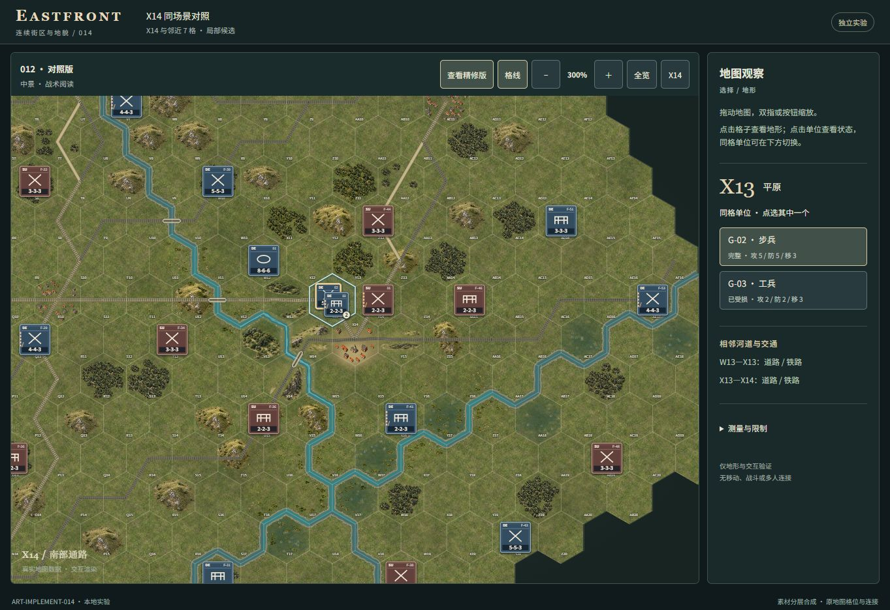
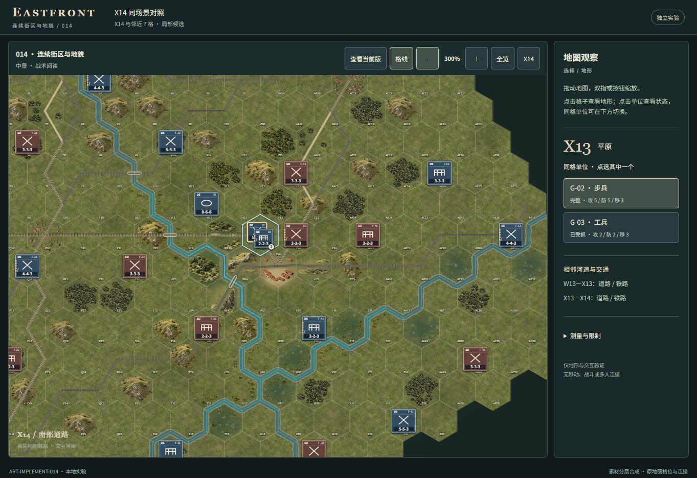
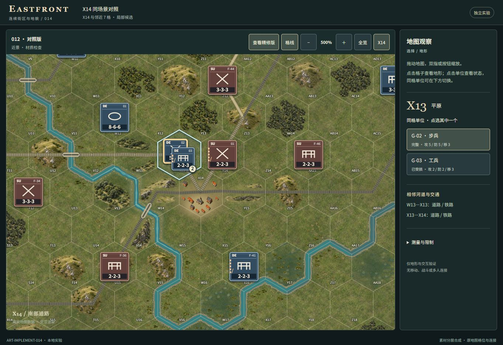

# ART-IMPLEMENT-014 evidence

Base: `ad359de4e78ce28e3e9aafcb2d14e0a0f003f20b` (012). One candidate, 2026-10-01.

## Actual browser comparison

The images below are unretouched in-app browser captures of the local build,
1363 × 936, G-02 selected on X13. The same document switches renderer variant;
`#world` style strings and selected-unit state were checked equal for each pair.
`screenshot-record.json` holds the camera values. All panels, labels and units
are from the application. The 012 capture uses the retained 012 rendering path
inside the 014 comparison shell; its header therefore says 014.

| 012 at 300% | 014 at 300% |
| --- | --- |
|  |  |

| 012 at 500% | 014 at 500% |
| --- | --- |
|  |  |

## Visual result and remaining gap

The southern roof groups now read as a courtyard composition at 300%, instead of
eleven isolated houses. W14's ridge silhouette is stronger; forest mass and soil
transitions meet the meadow more softly. Existing transport remains clearly
visible through the northern town approach and mountain foot. Rivers and
bridges retain 012 geometry. X14's label and the selected stack stay clear.

This is a modest implementation of 013, not a match to its architectural detail.
The existing single-building atlas becomes flattened when used for long ranges;
the eastern wing still has visible gaps. At 300% the shared court is readable
but small. Terrain still shows stamp repetition and strict corridor clearances.
The concepts' expanded settlement layout was deliberately not transferred.
No additional polishing round or new asset generation was performed.

## Verification

- Scoped TypeScript build and static dependency bundle: PASS (`build.log`).
- Seven targeted checks: PASS (`semantic-tests.json`): committed 012 placement
  baseline, exactly eight owned cells, outside placements, town footprint,
  all transport/unit/label clearances, river and bridge geometry, seven terrain
  masses, no data mutation, drag threshold and tracked-file scope.
- Actual UI: V13 reports forest; X14 retains its four adjacent transport records;
  G-03 map selection and G-02 stack disambiguation work. Buttons show 300%/500%.
  Dragging 70 × 30 px changes camera by that amount and retains G-02. Browser
  warning/error log was empty at inspection. See `browser-results.json` and
  `drag-selection.jpg`.
- Source review: existing renderer branches clip changed material to the eight
  cells. Outside art placement is unchanged. UI version labels are the intended
  outside-map difference. Exact whole-canvas pixel diff is unverified.
- No Core/rules/RNG/AI/supply/map/fixture/interaction module or runtime image
  changed. Frozen map SHA-256:
  `150ed628f53e9d1d3b2663157ec9a02678c0e09a840c03e404469a1a850ce0d3`.

## Cost and restrictions

The served artifact contains 76 files, 3,985,490 bytes including manifest versus
the locally retained 012 artifact's 76 files, 3,982,460 bytes: **+3,030 bytes**.
Both count raw file bytes, not compressed network payload. Five existing WebP
files are reused unchanged; new runtime image bytes: zero. Concept references
and screenshots are Git evidence only, excluded from the serving directory.

Same six source-based RGBA buffer categories as 012: main canvas 60,440,576 B;
all listed canvases 67,860,252 B versus 67,812,840 B: **+47,412 B**. The increase
is only the resized seven natural precompositions. These are backing estimates,
not measured RSS, peak memory or GPU/VRAM usage; decoded source images, temporary
ImageData, browser copies, gradients and garbage-collection overlap are excluded.
Full category values are in `cost.json`.

Startup is **UNVERIFIED**. The existing ordinary page export was attempted after
a fresh baseline navigation, but the download workflow timed out after 30.0359
seconds and returned no file. That timeout is a tool/download observation, NOT
page startup time. No CDP/runtime-evaluate workaround was attempted. The earlier
012 runtime inspection restriction and historical 708ms startup issue remain
open independently. No performance improvement or stable timing claim is made.
Physical touch pinch, Huawei hardware, GPU performance and live-match behavior
are also unverified. No unrelated full-suite testing was run.
