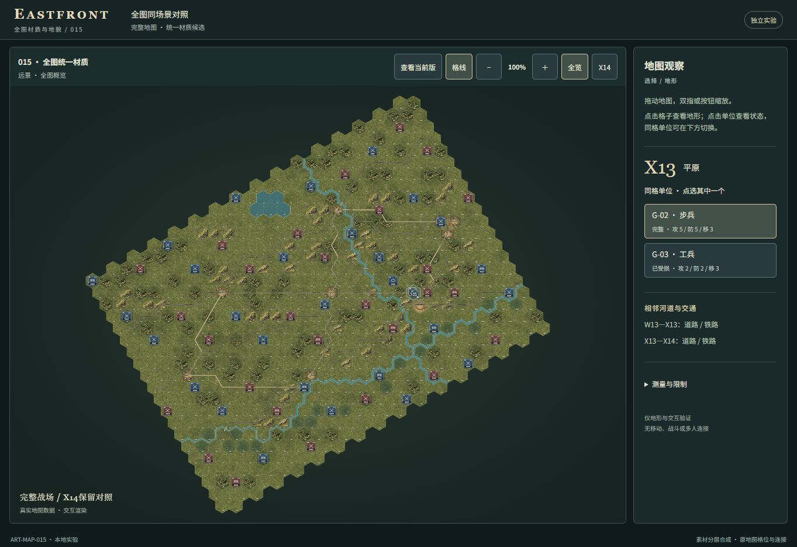
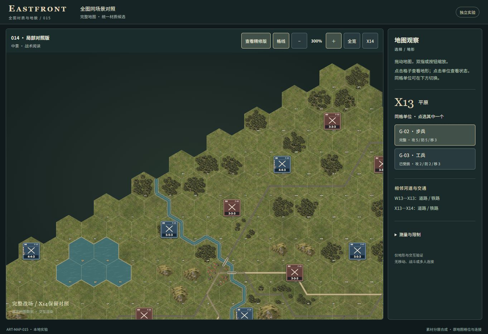
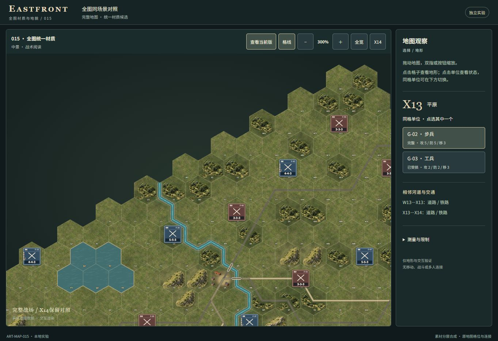
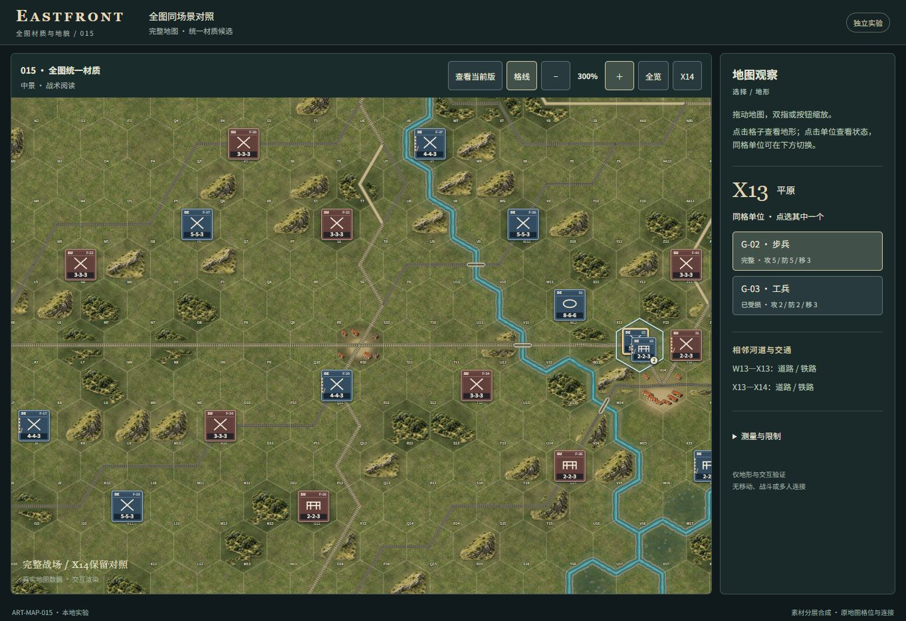
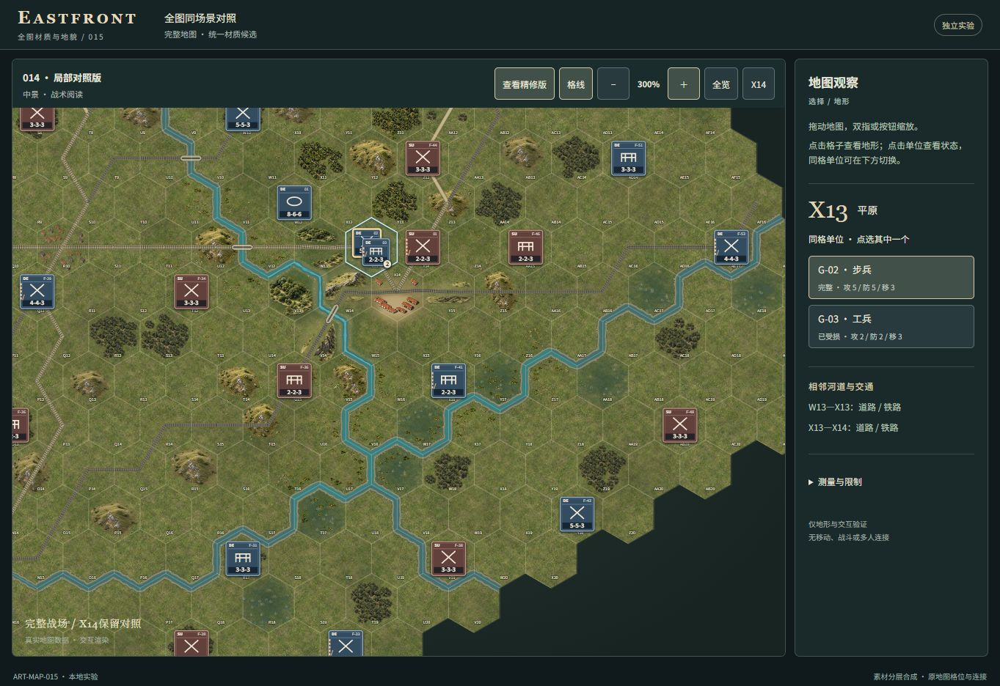

# ART-MAP-015: one full-map candidate

Baseline `1a33de2bf90fa3e97579482a0e534db8ff41927d`, 2026-10-01.

## Actual application captures

All images are original, unretouched browser screenshots at 1363 × 936. Same
document, G-02 selected on X13, same camera for each 014/015 pair. The comparison
shell is labeled 015 even when the 014 renderer is selected. Camera values and
equality checks are in `screenshot-record.json`. Concepts are not used as evidence.

| 014 full map, 100% | 015 full map, 100% |
| --- | --- |
|  |  |

| Area at 300% | 014 | 015 |
| --- | --- | --- |
| Northern woodland, W2 |  |  |
| Central town, R10 |  |  |
| Southern river network, W16 |  |  |

Additional reference: [014 X14 at 500%](014-x14-near.jpg) /
[015 X14 at 500%](015-x14-near.jpg). The original eight-cell composition is
preserved; its surrounding scene now follows the same material vocabulary.

Reproduce with the commands in `experiments/art-map-015/README.md`. At the
specified viewport, click G-03 then G-02; Full view gives 100%. From Full view,
drag W2's center approximately (555,278) to (543,521), R10 (567,501) to (543,521),
or W16 (719,562) to (543,521), then press plus eight times for 300%. Exact world
style strings in the screenshot record are authoritative. Variant switching
preserves them. X14 button restores the accepted 500% reference camera.

## Visual assessment

Forests now share the 014 canopy mass, upper-left light and soil/edge treatment
across the map. Relief uses the same ridge materials and preserved volume.
River color/depth and broad bank moisture become consistent while all paths,
crossings and bridge geometry stay fixed. Open plains keep clear maneuvering
space. Cities use related courtyard/wing rules fitted to their real free space,
not one layout copied into every city.

The result is coherent but not uniformly dense. R10 and other crossroads still
read as separated small groups because transport divides their usable space.
The same limited ridge and canopy atlas shapes remain visibly repeated. AC10's
F-49 fixture excludes all roof footprints; city ground and label remain. It is
not claimed that every city matches X14's continuous courtyard quality. One
candidate was completed; no further aesthetic polishing rounds followed.

## Verification

- Scoped TypeScript build and dependency bundle: PASS.
- Eight targeted regression groups: PASS (`semantic-tests.json`). Full raw map
  SHA-256 remains `150ed628f53e9d1d3b2663157ec9a02678c0e09a840c03e404469a1a850ce0d3`.
  640 cells, 257 edges, 58 display fixtures; terrain counts and full semantic
  registry/fixture data are saved in `semantic-map.json`.
- Approved eight-cell placements equal the committed 014 golden. Every city
  roof clears canonical cell boundaries, transport/water corridors, unit
  envelopes and labels. 232 new natural precompositions exercise the actual
  alpha-mask function; 74,348 blocked sample positions are transparent. This
  is geometry/alpha regression, not a replacement for browser screenshots.
- Source checks retain river chain/width math, road/rail gap and bridge painting,
  click/selection/gesture handlers, map/fixture definitions and frozen modules.
  No Core/rules/RNG/AI/supply changes. No image asset changes.
- Real UI: W2 reports forest; R10 reports city with its original four transport
  connections. G-03 → G-02 stack choice works. A 70 × 30 px drag preserves G-02
  and changes camera by the same amount; zoom reaches 300%. No warning/error log
  was observed. See `browser-results.json` and `drag-selection.jpg`.
- Labels/counters stay readable in the representative 300% views. All-city roof
  and full natural-mask clearances were checked computationally. Exact whole-map
  pixel acceptance and every device/viewport combination remain unverified.

## Cost: same accounting as 014

| Metric | 014 | 015 | Change |
| --- | ---: | ---: | ---: |
| Runtime files, including manifest | 76 | 77 | +1 layout module |
| Raw package bytes | 3,985,490 | 3,996,913 | +11,423 |
| Main canvas RGBA backing | 60,440,576 | 60,440,576 | 0 |
| Sum of listed canvas backing estimates | 67,860,252 | 67,933,116 | +72,864 |
| DOM elements, same G-02 state | 2,457 | 2,457 | 0 |
| Hit cells / labels / unit groups / map canvases | 640 / 640 / 58 / 1 | 640 / 640 / 58 / 1 | 0 |
| New runtime image assets | — | 0 | 0 |

The only added canvas category is one reusable scratch buffer, not one buffer
per cell. Package counts include both comparison paths; evidence is not served.
Buffer values are source-based RGBA estimates using the same six 014 categories
plus scratch peak. They exclude decoded images, temporary ImageData, gradients,
GC overlap, browser copies, RSS and VRAM. They are not measured GPU memory.

Startup comparison is **UNVERIFIED**. The known 014 ordinary-export timeout and
012 runtime inspection restriction were not retried. Historical 708ms remains
open independently; no timing improvement is claimed. Physical touch pinch,
Huawei hardware, GPU performance and live-match integration are unverified.
Only the relevant build and regressions were run. No merge, PR or deployment.
