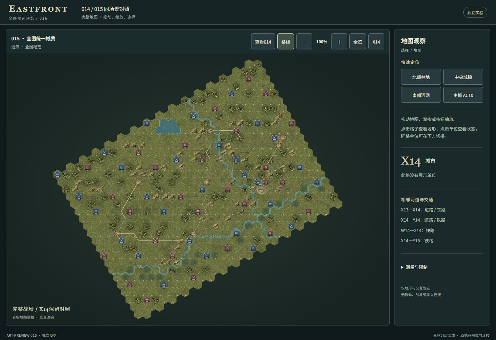
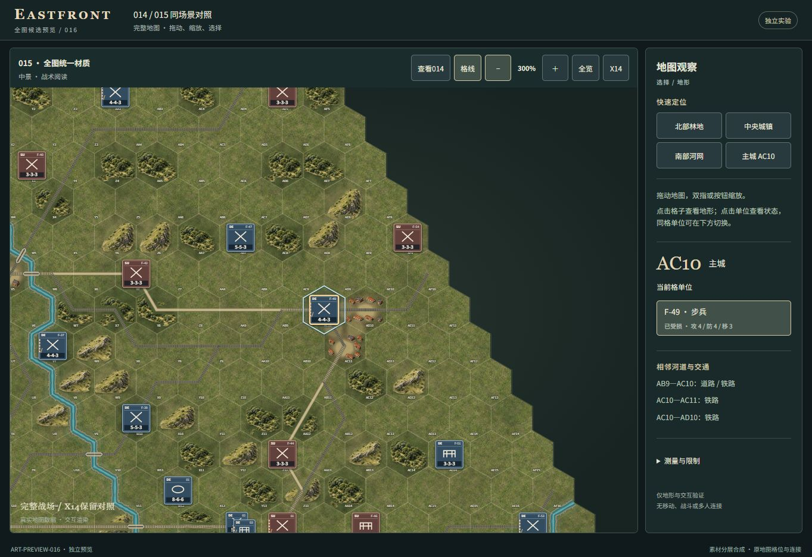
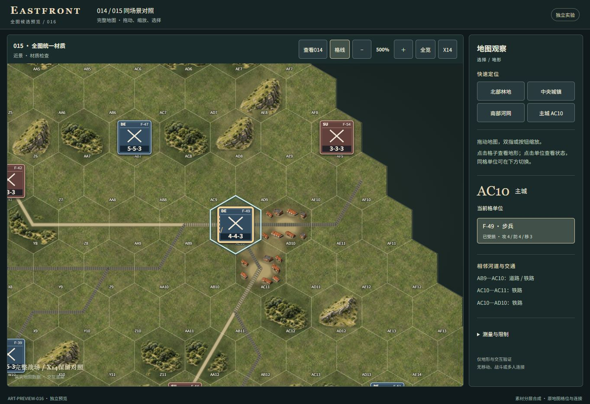

# ART-PREVIEW-016 readiness evidence

Visual baseline fixed to `35e36314b61e157be016040d91d9d05eeaf39f5a`.
No art, map, rule, AI, supply or existing interaction-handler edits.
Local interactive entry: http://127.0.0.1:44116/?view=full .
No remote publication/deployment was performed.

## What is prepared

Existing standalone Canvas/SVG preview and runtime-only builder reused. The
default entry now shows the whole map at 100%; four sidebar buttons locate north,
central, south and AC10. X14 and 014/015 switching remain available. URL query
entries support direct opening. Camera changes preserve selected units and feed
the same viewport state used by existing drag/zoom handlers.

Actual regional entry screenshots:
[north](entry-north.jpg), [central](entry-central.jpg), [south](entry-south.jpg),
[1024px entry layout](entry-1024.jpg), [drag/selection](drag-selection.jpg).
All are unretouched application captures, not concepts.

## AC10: recognition is limited

At both 300% and 500%, AC10 has no roofs because F-49's reserved footprint leaves
no safe building envelope. The warm city material is still rendered, but mostly
covered by the unit. The coordinate label is small/near the unit edge and does
not encode city type. **Ground tint and map label alone are not a reliable city
recognition signal in the present occupied view.** Nearby AC11/AD10 buildings
provide context but do not prove AC10's own type.

Selecting F-49 exposes **AC10 主城** in the existing inspector, with the original
AB9 road/rail and AC11/AD10 rail connections. Thus data/interactive identification
is clear, while unaided map recognition remains an explicit visual acceptance
limitation. No roofs, icons, city flags, unit moves or map changes were added.

| 300% | 500% |
| --- | --- |
|  |  |

## Checks and cost

Build succeeded with the existing strict TypeScript pipeline. Six focused entry
and artifact checks passed (`entry-checks.json`):

- All 015 art/layout/map/assets and existing runtime dependencies retain their
  exact SHA-256. Only HTML, CSS, viewer entry and one new camera-preset module
  differ. Existing 015 semantic/layout/mask tests are reused, not rerun.
- Full manifest/file list and every file's local size/hash verified.
- Six camera presets and invalid-view fallback checked mathematically.
- Existing selection, stack, drag/wheel/pinch/zoom handlers remain source-identical.
- Runtime root has self-only CSP and no game bootstrap/source/evidence/backend
  config; the optional 016 entry has the existing production-host protection.
- 78/78 local HTTP paths return 200 and byte-identical payloads. Direct index and
  query entries return the correct shell. These are local HTTP checks, not CDN
  or startup performance measurements.

Actual browser checks (`browser-results.json`): north/central/south buttons show
300% and preserve F-49 selection; direct north/014, central/015 and index/south
entries load correctly. 014/015 switch preserves camera and G-02 selection.
G-03 → G-02 stack choice works. Dragging changes camera by 60 × 30 px and retains
G-02. Four shortcut buttons remain available at 1024 × 768. No warning/error log
was observed. Desktop pointer only; physical touch/Huawei remain unverified.

Artifact: **78 files, 3,999,290 B**, including manifest; +2,377 B versus 015.
No new runtime images. Canvas buffers unchanged from 015, estimated **67,933,116 B**
across the same listed categories (main canvas 60,440,576 B). Same G-02 state:
DOM **2,464**, +7 shortcut elements; 640 hit cells, 640 labels, 58 unit groups and
one map canvas unchanged. These are backing estimates, not RSS/VRAM/GPU memory.

No working startup capture channel was available. The 014 export timeout and 012
runtime inspection restriction are retained; neither failed channel was retried.
Startup/708ms issue, GPU, Huawei and physical touch acceptance remain open.
Cloudflare deployment, assigned URL, CDN hashes and online interaction checks
are unverified because publication is intentionally deferred.

## Fixed scope and recovery

Prepared release SHA `86241e5d24ed9457f54891056b90abe9772b25f3`, tree
`35a2522c00d1a2dad0612721e14fcaf48b3e62bd`, target `art-map-preview-016`.
The local release ref is separate from remotely saved source/evidence. Exact
runtime files, raw commit bytes and withdrawn-page tree are in Git. See
[PUBLISH.md](PUBLISH.md) for precise future steps and non-force withdrawal.
