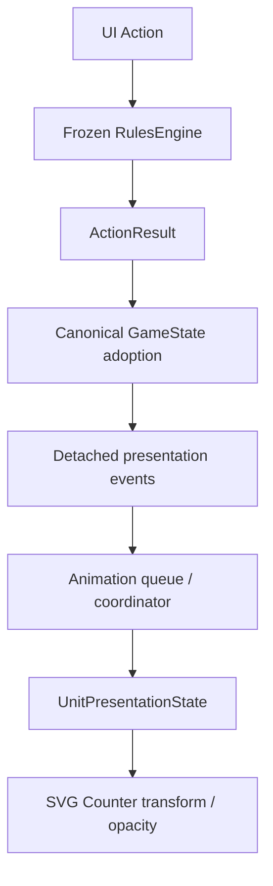

# EASTFRONT UA-001 — Animated Unit Presentation Foundation

Baseline commit: `d8e651cb84ad19f2901eacd282526fcb9deba65e`

Baseline tree: `dc6db20fa4599eb946735344539a5430c15d5495`

本轮为独立 `animation/ua-001` 开发 checkpoint。未部署、未合并 gameplay main。

## Architecture



Core 状态接受、合法性检查、combat RNG 和结果全部先完成。`src/core-adapter/session.ts` 的 UI adapter 仅增加三行：导入通知函数、保留 prior-state 引用、状态与 integrity 更新后发布通知。它不是 vendor Core 的修改。没有动画 Promise、完成回调或速度选择参与 Core action 接受。

`derivePresentationEvents(before, result)` 只读取正式已接受结果；从 Core events 和实际前后单位位置取出表现需要的最小值。发布的对象递归冻结且与 Core 脱离引用。订阅者不获得 GameState / ActionResult 引用；事件不包含 CRT、战力、补给、所有权或随机状态。事件投影或订阅者异常不能撤销或拒绝已经接受的 action。

### Modules

| Module | Responsibility |
| --- | --- |
| `src/presentation/events.ts` | Immutable, detached event projection from actual accepted Core facts |
| `src/presentation/transitionBus.ts` | Session-identity WeakMap observers; unsubscribe and failure isolation |
| `src/presentation/timing.ts` | Central duration constants and normal/fast/instant multipliers |
| `src/presentation/coordinator.ts` | Sequential barriers, optional parallel events, phases, interpolation and lifecycle hooks |
| `src/presentation/svgUnits.ts` | DOM bindings and unit/hit-target attribute painting only |
| `src/presentation/runtime.ts` | UI-owned session lifetime, reduced motion, speed, skip, remount and cleanup |
| `src/ui/animationControls.ts` | Localized compact speed selector and skip button |

## Implemented events

| Presentation event | Authoritative source | UA-001 behavior |
| --- | --- | --- |
| move | UnitMoved + accepted MOVE path + actual before/after hex | Visible movement |
| retreat | UnitRetreated + path | Same visible travel foundation |
| advance | UnitAdvanced | Same visible travel foundation |
| breakthrough | UnitBrokeThrough + path | Same visible travel foundation |
| combat-started | CombatDeclared | Timed setup hook; no fire before a result |
| combat-fire | CRTResolved | Timed fire hook, emitted only after resolution exists |
| combat-result | CRTResolved | Zero-duration sequencing barrier; no stored CRT truth |
| hit | UnitStepLost | Timed reaction hook |
| destroyed | UnitDestroyed | Timed hook; canonical renderer controls removal |
| combat-completed | CombatCompleted | Completion sequencing hook |

Lifecycle callbacks receive only `(presentationEvent, started | finished | skipped)`. Damage/destroyed/fire artwork remains for UA-002/003. UA-001 does not keep destroyed ghost counters or temporarily invent undamaged gameplay values.

## Unit state and movement

`UnitPresentationState` contains only unit identity, current/target visual position, current canonical visual anchor, phase, normalized progress, emphasis, opacity and visibility. It has no gameplay status fields.

Declared phases: idle, moving, windup, firing, hit, retreating, advancing, breakthrough, destroyed. The visible travel prototype uses moving/retreating/advancing/breakthrough. Combat phase names and lifecycle hooks are prepared for subsequent effect renderers; UA-001 does not render firing, hit or destroyed effects.

Before: the accepted destination was rendered immediately.

After: Core still adopts that exact same destination immediately. Before the browser can paint it, runtime applies the actual source visual position to the freshly rendered Counter. It interpolates along every accepted waypoint using the unchanged `hexToPixel`. At the end it removes the temporary transform and restores the exact canonical Counter V2 layout from the latest render. There is no initial destination flash followed by a replay.

Canonical path pixels are cached on enqueue. Stack endpoints reuse unchanged `deriveCounterPlacement`; intermediate points lie on canonical hex centers. Nonmoving stack members use the current Core layout. Moving expanded touch targets keep their original unit identity and follow the visual anchor; Counter NATO symbols, damage, stats, scale, stack badge, selection and routing remain unchanged.

Far/Medium/Close all retain Counter V2. No miniature or effect obscures strategic information in UA-001. The event/coordinator boundary can support separate medium/close overlays later without replacing the far Counter.

## Queue and timing

Default: sequential events in Core order. Optional `AnimationStep.parallel` is a barrier for disjoint units. Conflicting same-unit clips within one parallel step are serialized. Queued travel remains at its source until its step begins. Normal runtime uses `append`; `finish-and-replace` is an explicit interruption option.

| Constant | Normal duration |
| --- | --- |
| MOVE_STEP | 260 ms / hex |
| COMBAT_WINDUP | 160 ms |
| COMBAT_FIRE | 120 ms |
| COMBAT_RESULT / completed | 0 ms barrier |
| HIT_REACTION | 150 ms |
| RETREAT_STEP | 220 ms / hex |
| ADVANCE_STEP | 240 ms / hex |
| BREAKTHROUGH_STEP | 200 ms / hex |
| DESTROYED | 160 ms |

Fast uses 0.4× duration; Instant schedules no frames. Mid-animation speed changes retain progress. Skip clears the queue and temporary state, restores canonical render values and cancels RAF. Late frames can cross several barriers. Session replacement, hidden map and dispose release prior work; pagehide settles playback. `prefers-reduced-motion: reduce` forces effective Instant while retaining the user's normal/fast/instant preference for when the preference changes back. There are no animation `setTimeout`/`setInterval` calls.

Language changes/remounts rebind to current elements and immediately reapply the current presentation position. Camera state and transform functions are unchanged. Animation speed is session UI preference and is not persisted across a page reload in UA-001.

## Performance and determinism

One RAF coordinator per application, no loop while idle. Per-frame writes are limited to active Counter transform/opacity/phase attributes and moving touch-target transforms. Existing terrain caching, LOD, assets and world-surface code are unmodified. No per-frame Core queries, GameState copies, full SVG generation, canvas painting or VS2 builds occur.

A test builds the actual production VS2 world surface with mock image/canvas I/O, then runs 60 real coordinator frames and repeated Counter remounts. World-build and canvas-draw counts stay unchanged. This verifies execution boundaries, not Huawei GPU frame rate.

No presentation randomness is used. No gameplay RNG import/access or global entropy call is needed by animation. Future visual variation must use a separate stable presentation hash/RNG. Identical combat actions across six seeds and three speeds yield identical serialized GameStates, including RNG state/draw count, with and without an animation subscriber.

## Evidence and reproduction

- `movement-runtime-sampled.gif`: before/after software-rasterized Counter V2 animation samples. It is NOT a browser capture; GIF display is slowed for inspection.
- `movement-midpoint.png`: 130 ms sample of the 520 ms two-step movement.
- `movement-trace.json`: all 33 sampled transforms, canonical position, Core destination and unchanged RNG snapshots.
- `sampled/`: original exact SVG and rasterized PNG frames.
- `movement-demo.html`: interactive isolated Core-driven movement fixture with actual runtime, speed, skip and language controls.
- `generate-evidence.mjs`: sample generator; uses Sharp only for offline review rendering, not in the app.

Run from the repository root:

```sh
npm install
npm run typecheck
npm test
node scripts/serve.mjs .
```

Then open `http://127.0.0.1:4173/evidence/ua-001/movement-demo.html` for the isolated fixture, or `http://127.0.0.1:4173/dist/` for the full production game. The demo imports the compiled app and test fixture; it is intentionally not copied into release dist.

## Validation

- Baseline commit/tree exact; working tree CLEAN before modification.
- Baseline: typecheck PASS, build PASS, **254 / 254** existing tests PASS.
- Final: typecheck PASS, build PASS, **285 / 285** tests PASS; **31 new**, 0 deleted, 0 skipped.
- The existing localization VM fixture now supplies the newly imported runtime and controls. Every old assertion is unchanged.
- Existing UX2/UX2.1 three-click attack, multi-attacker, retreat/advance, localization, fresh seed, geometry, Counter, Camera and VS2 tests retained and passing.
- New tests cover every requested boundary plus sequential/parallel/interrupt, errors, reduced motion, queue cleanup, actual combat hooks and live VS2 cache isolation.
- `frozen-scope.json` records exact unchanged baseline file hashes and protected function-span hashes.

## Remaining validation / known limitations

**browser manual validation pending**

The local runtime has no installed Chromium binary. Browser installation failed because the browser-download endpoint timed out / returned 502. No real-browser, Huawei-tablet, screenshot, frame-time, touch-hit-layout or GPU-performance PASS is claimed. The supplied animation evidence is actual runtime sampling plus software rasterization, not browser evidence.

Leader should check full-game movement, source/destination stacks, pan/zoom during playback, language remount, narrow-screen animation controls, normal/fast/instant/skip, OS reduced motion and new-game cleanup on desktop and Huawei tablet. Combat hooks are architecture only beyond the shared travel animations. Cinematic camera, particles, models and 2.5D art are outside scope.

No Core changes.
No combat rule changes.
No gameplay RNG changes.

READY FOR LEADER REVIEW
