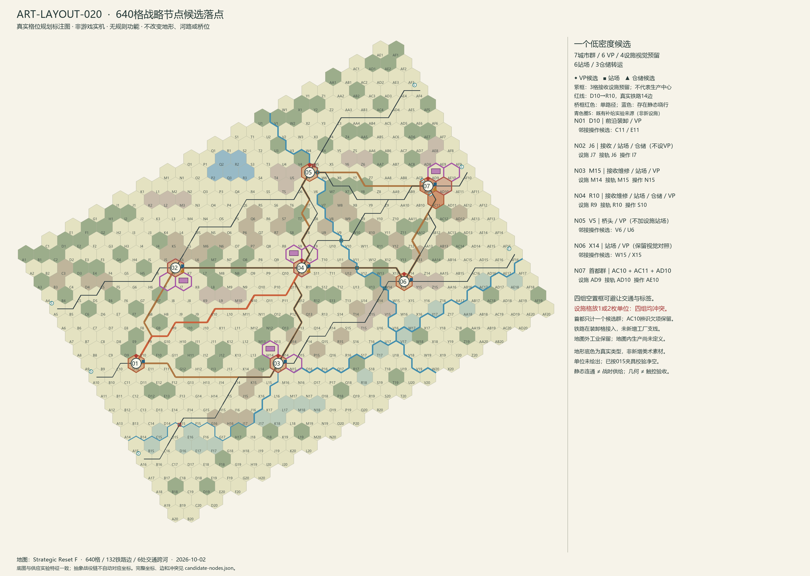

# ART-LAYOUT-020 640格战略节点候选落点

2026-10-02。基线：`69eb6b3369fcf47ba51891dd0ad9dc08c35e54a0`。

交付一个低密度空间候选：7个既有城市群、6个VP群、4组设施视觉预留、6处功能站场、3处仓储/转运候选。**四组预留不是四处地图内生产中心。** 依用户补充及工业003固定提交，当前工业模型仍在地图外，战区接收点仍为抽象对象。本清单只供规则和工业审查，未将抽象接收点接入真实坐标，也未赋予生产、供给、维修或计分功能。

空置设施的假设包围框均可避让真实交通、河岸和标签；若单位进入设施格，四组均有覆盖冲突。可接受的是空间候选，不能写成完整设施、交互或战时补给验收。

图按015实际六边形顶点、河流边界与交通中心线绘制；没有使用概念图、生成图片或新游戏素材。图中的朝向保持现有美术几何，不把纸面“列”直接画成竖直轴。青色圈S是补给实验既有来源，紫色为接收设施预留，二者含义不同。完整数据见[候选节点JSON](candidate-nodes.json)。

## 候选落点

| ID / 城市群 | 锚点轴坐标 q,r | VP候选 | 功能站场 | 仓储转运 | 设施视觉预留，按设施/接轨/操作顺序 |
| --- | --- | --- | --- | --- | --- |
| N01 / D10 | 3,8 | 是 | D10，前沿装卸 | — | 不设生产或大型接收设施 |
| N02 / J6 | 9,1 | — | J6 | 候选 | J7 / J6 / I7；装卸、仓储空间 |
| N03 / M15 | 12,8 | 是 | M15 | — | M14 / M15 / N15；装卸、维修空间 |
| N04 / R10 | 17,1 | 是 | R10 | 候选 | R9 / R10 / S10；装卸、仓储或维修空间 |
| N05 / V5 | 21,-6 | 是 | 不增功能站场，既有交汇保留 | — | 不在双桥门户增加设施 |
| N06 / X14 | 23,2 | 是 | X14 | — | 保留015视觉对照，避免靠近X13双牌、Y14单牌追加设施 |
| N07 / 首都群 | AC10为28,-5 | 一个群 | AD10侧接入 | 候选 | AD9 / AD10 / AE10；战区接收、仓储空间 |

首都群统一包含 **AC10(28,-5)、AC11(28,-4)、AD10(29,-5)**，不按三块绘制格拆成三个VP。N07涉及格集合为这三格加AD9、AE10；其中设施预留子集仍为3格。其余设施群也按城市群、设施子集和邻接操作空间分别记账，不把角色数相加成新占格。

N02不给VP是本候选的审查假设：用于考察“有后勤空间但无额外分值”的地点价值，不代表规则已决定J6不计分。D10、V5保留前沿与桥头目标，避免候选只围绕后方设施；VP权重、初始归属、控制条件与双方公平性全部交规则Worker确定。

JSON逐节点提供稳定ID、纸面/轴坐标、城市群、候选角色、涉及格集合、真实接入边、邻接操作格、015展示单位、共享冲突和理由。ID是本候选的稳定标识，不写入Core，也不占用运行期设施ID。VP权重、初始归属、占领条件、工业类型和产出字段明确为null。

## 工业003的边界

核对来源：[固定METHOD.md](https://github.com/jnmbys/eastfront-web-preview/blob/5cac9bd81a9776b8a2e2837f33818c0c72561ba4/docs/industry-integration-003/METHOD.md)。该方法采用地图外工业与抽象战区接收点，且说明仍属实验复建方法，尚未统一为运行合同。核对摘要及文件哈希见[industry-reference.json](industry-reference.json)。

| 对象 | 本次坐标表达 | 状态 |
| --- | --- | --- |
| 地图外工业生产 | 无地图内格位 | 保留003模型；不因前线接收点敌占就推导全国工厂失守 |
| 地图内工业生产候选 | 未提出生产中心清单，生产格集合为空 | 工业设计尚未定义类型、尺寸、产出和归属；四组预留不能默认转成工厂 |
| 战区接收、装卸、仓储、维修 | J6、M15、R10、首都群附近的空间候选；D10另作前沿装卸点 | 仅表示能研究的角色；不证明可消费装备、可修复单位或满足物流资格 |
| 补给来源 | 固定配置已有节点独立列出 | 不从仓库/车站/建筑外观新增供给；不修改来源能力 |

“接轨格”指该格已有真实铁路相接。设施格与接轨格相邻且没有跨河边界，但没有新增厂内支线，也没有批准的跨格装卸/维修服务关系。因此本次不是工业003抽象接收点的自动坐标迁移；必须另行批准接收点ID与候选群的映射。

## 地图版本和对应关系

完整证据见[版本核对](map-version-audit.json)、[640格坐标表](coordinate-correspondence.csv)、[来源清单](source-manifest.json)。

| 引用 | 固定版本 | 核对结果 |
| --- | --- | --- |
| 美术019 candidate地图 | `69eb6b3369fcf47ba51891dd0ad9dc08c35e54a0` | 本次落点基准；与015地形和特征边证据核对 |
| RULE-CAMPAIGN-001 / 002起点 | `7c747c1b427faf18e811a3c1e9905b8615e3433c` | vendor与core/source地图均与美术文件逐字节一致；002进行中，本次不声称审过其最终契约 |
| SUPPLY-UX-020主体引用 | `a06737e95e40acdb79580e6b2fe32a9aaba2d2e4` | vendor与core/source地图均逐字节一致 |
| CAMPAIGN-001研究分支 | `64566985664fff7652fb5a510477ce25d2b05018` | 所带两份地图逐字节一致；其账本本身使用无真实坐标的0–8抽象链 |
| 补给生成数据core-map | 自报源提交`f8e732138a8e3c01d2885ddac09a33e2fedfec18` | 本地观察文件，不在上述补给提交中；已保存[规范化快照](supply-map-snapshot.json)，不能冒充已固定的运行快照 |

共同正式地图SHA256：
`150ed628f53e9d1d3b2663157ec9a02678c0e09a840c03e404469a1a850ce0d3`。
纸面转换为`q=列号−1，r=行号−1−floor(q/2)`；640格纸面ID、轴坐标及地形一一相同，没有格位迁移。

差异明确保留：

1. 美术存257条带特征的边；补给生成数据存1817条全邻接边，其中同样257条带特征、1560条无特征。补给地面通行的“road模式”不等于物理公路，不能把1817条全画成道路。
2. 8条边的序列化端点顺序相反；按无向边规范化后，公路、铁路、河流和桥字段无差异。边清单在版本核对文件中；没有改写任何源文件。
3. 补给实验已有来源：G为A5/A10/A16，S为AF4/AF10/AF16/AC10/AC11；已有枢纽：G为A5/C10/A16，S为AC10/AC11/AF10。本候选J6/R10/首都群的3处仓储**不替代**这些来源或枢纽。美术固定defaultScenario的入口/出口和苏方源配置也不是工业设施名单。
4. CAMPAIGN-001的抽象0–8链和实验初始归属、VP不能逐项套到N01–N07。规则024的类别预算也不等于已落点的目标清单；本轮不复制权重、不设置owner。
5. 补给生成数据的桥状态是导入器推断的完好桥，不是当前战局损坏/修复快照。规则002基线检查与其后续时序契约审查是两项工作。

## 设施空间检查

四个3格组共12个不同预留格；设施内容假设38×20、每侧2缓冲，包围框42×24，中心相对各设施格为(0,-5)。尺寸是现有渲染世界单位，不是米、不代表定稿设施大小或工业生产规格。没有制作建筑素材。

| 组 | 设施格 | 标签和交通 | 单位覆盖 |
| --- | --- | --- | --- |
| N02 | J7 | 空置包围框通过；装卸格J6有真实铁路 | 设施格单/双单位冲突；J6/I7的68×68单位框与设施框不相交 |
| N03 | M14 | 空置包围框通过；装卸格M15有真实铁路 | 设施格单/双单位冲突；M15/N15的单位框与设施框不相交 |
| N04 | R9 | 空置包围框通过；装卸格R10有真实铁路 | 设施格单/双单位冲突；R10/S10的单位框与设施框不相交 |
| N07 | AD9 | 空置包围框通过；装卸格AD10有真实铁路 | 设施格单/双单位冲突；AD10/AE10的单位框与设施框不相交 |

检查使用真实六边形边界、道路/铁路中心线两侧7、河岸两侧7或9、格标签20×10（中心下方29）及单位68×68净空。四角必须在格内，包围框不碰相邻标签，交通/河岸距离按矩形到真实线段计算；现有015全部58枚展示夹具也参与遮挡检查，未移动任何单位。
这只是几何范围检查，未评估真实资产阴影、烟囱、文字可读性、触控命中或法规意义的建设许可。四组在设施格有单位时都需要批准覆盖策略；不能以禁止进格、挪单位或抹掉设施语义来制造通过。

**排除M16：** 它与M15、N15之间均有无桥河流边。空置框能摆下并不证明可达站场，因此不采用M16；最终N03改用同城北侧M14。该筛选仅改变研究候选，没有补桥或改铁路。四个最终设施格与接轨格之间均无河流边界；跨格服务资格仍未定义。

## D10长段和桥头风险

D10到下一城市群R10的最短铁路为14边：
`D10→E10→F9→G10→H9→I10→J10→K10→L10→M11→N10→O11→P11→Q11→R10`。
其中前13边删除任一条，两个端点在完整铁路图中都不再相连；Q11–R10另有绕行。D10因此适合作为需要审查的前沿装卸候选，但不能靠新增一张站场图消除长段或吞吐瓶颈。本轮不为凑站距增加中途城市、站点或来源；规则需决定行程/运输能力、前沿库存和中断影响。

| 跨河边 | 移除该桥后静态铁路绕行 | 布局意义 |
| --- | --- | --- |
| D15–E15 | 无 | 南部西向支路单路径，不能靠M15设施消除断联 |
| V5–W5 | 无 | 北部外向支路单路径；V5另一座桥不替代这条支路 |
| V5–W6 | 18边 | 虽有绕行，仍可能显著增加路径；不等于战时可用 |
| U10–V10 | 18边 | 中部跨河需要另审控制与损坏状态 |
| U12–V12 | 24边 | 长绕行不等于等价容量或时效 |
| V14–W14 | 24边 | 南部跨河与X14周边操作空间需一起审查 |

证据保存了每条绕行完整路径：[network-risks.json](network-risks.json)。仅计算无损、无向铁路图，不计控制权、敌军、运力或修复。图上有替代线路不能标为战时补给通过。

## AC10及交付限制

AC10的F-49展示单位让屋顶避让，未选中时城市辨识欠项仍在。因此不采用“只用AC10屋顶判断首都/站场/仓库/工厂”的表现方案。N07仍统一三个城市格；设施假设框移在AD9、接入侧放AD10。规划图的N07徽标只是研究标注，不是已经修复运行界面的首都识别或新增标签。

待审事项及责任见[冲突与待确认清单](CONFLICTS.md)。随机模板沿用019，本轮没有继续扩展；未运行产品构建或全量回归。启动、GPU、华为、选择/堆叠消歧、拖缩和物理触控待验项均保留，历史708ms问题不作新结论。

运行资源、Canvas和DOM增量为0，因为全部新增文件只在研究目录，不进入运行产物。标注PNG是文档附件，不是游戏素材。没有合并、PR、部署或后端设置变更。

## 复核和恢复

运行`python research/ART-LAYOUT-020/build.py`可从已保存输入重算核对、候选、冲突数据与标注图；绘图需要Pillow，当前Codex已用内置Python环境完成。`--capture`只在能够访问所列固定Git对象及补给生成文件时重新采集外部证据，普通复核不依赖其他Worker工作目录。
定向检查结果见[validation.json](validation.json)。文件变更范围核对保证仅新增`research/ART-LAYOUT-020/`；正式地图SHA与019相同。适用父目录及本树未发现AGENTS.md、PROJECT_STATE、WORKER_PROTOCOL。

独立分支`art-layout-020`，提交使用`[CF-Pages-Skip]`。恢复研究可在独立目录检出019基线；本轮未修改产品，无需回滚生产或015预览。固定预览发布`86241e5d24ed9457f54891056b90abe9772b25f3`不变。
