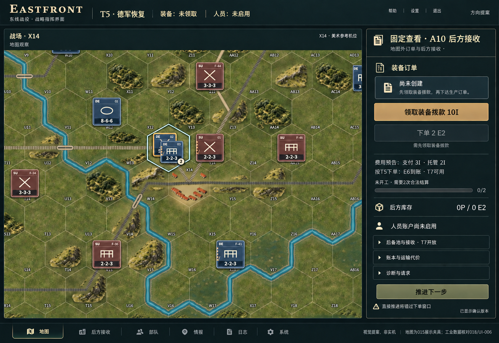
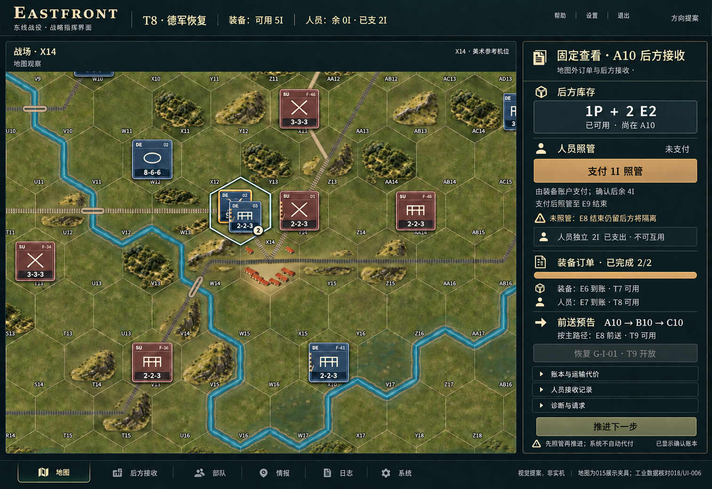
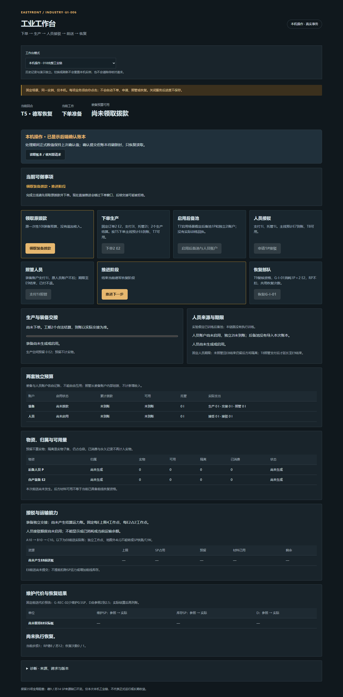

# ART-UI-DIRECTION-021｜地图主导的工业界面提案
日期：2026-10-04。分支：art-ui-direction-021。基线：2aa9a655e2906667929f3828d4dd6f58d7286ea2。

**本轮仅供确认视觉方向，非实机、未接入、未部署。** 两张生成图以015的X14真实参考机位为构图依据，固定查看A10后方接收账本；不是T5/T8真实战局截图。没有改任何运行文件。

## 直接查看
### T5下单前：先领取装备拨款

### T8照管前：先处理人员期限

### 原界面对照：INDUSTRY-UI-006真实T5

原图1440×2915为滚动长截图；提案1512×1040为一屏构图，不能按截图高度比较性能或信息容量。T8已有原图[提交后等待账本](references/ui006-t8-committed-waiting-original.png)属于照管已经提交后的读失败检查，**不是T8照管前**；没有把它冒充同状态对照。T8提案采用真实浏览器version37与018账本核对的数据。

## 1. 已有能力与接入状态
|来源与固定提交|认可/实现状态|本轮用途及边界|
|---|---|---|
|ART-MAP-015：35e36314b61e157be016040d91d9d05eeaf39f5a|用户认可；全640格独立美术查看器已实现，016有独立比较预览|复用五张图集、暖屋顶院落、林缘/山脚、统一左上光照。未称已接入主体游戏|
|ART-EXPANSION-017：754da7cdfb7a343f51d7a008cec921c4dbd9d0fa|60格合成拼接样片；布局变化与工业净空验证|只作材质/空间参考；不是正式地图扩图，不是已批准工业建筑|
|ART-LAYOUT-020：2aa9a655e2906667929f3828d4dd6f58d7286ea2|已验收的坐标和空间研究|不生成VP、生产中心、补给来源等规则功能；首都群仍为AC10/AC11/AD10|
|INDUSTRY-UI-006：75183910f524c87d9a6db3fafee27f3a2e189691|本机工业功能页、真实HTTP链与故障证据|提供七操作、账目、资格、期限与R1行为。不是旧UI-006渲染器任务|
|工业018：0f31196d998fb9be8e27e2183161fb4cec0f01e1|真实隔离工业后端与T5→T9链|提供账本来源；不意味着生产服务或主体游戏已经集成|

资料：015/017各自evidence/REPORT.md及真实截图；020研究目录；UI-006的README.md、CHAIN-018.md、BROWSER.json、chain-view.mjs；018的README.md、API.md、LEDGER.json。来源和散列见sources.json。

## 2. 构图与信息层级
地图占主要画幅，紧凑顶栏显示回合、阶段及两套独立账户；暖屋顶、山体体积、铁路和单位轮廓仍是视觉主体。地图外的深色哑光面板与细分隔线不侵占地形净空。主操作只有当前需要的一个，NEXT降低强调但保留可用性与后果提示。
右栏是“固定查看A10”，不是将X14改名A10，也不是在A10画工厂。正式实现应由对象选择打开上下文面板，并允许明确的固定查看；当前选中地图夹具与固定查看对象分开标识。
订单、库存、照管期限用一条连续信息流呈现。详细账本、运输代价和诊断按需展开。正常账本状态仍可见；异常锁定必须在主操作上方常驻，不能只藏进诊断折叠区。
底部地图/后方接收等标签仅示意导航层级，帮助、设置等位置也只是构图占位，不新增情报、FOW或其他功能授权。

## 3. 两个检查点：事实与预测分开
|项目|T5，version0 / gameRevision109|T8，version37 / gameRevision142|
|---|---|---|
|阶段|GERMAN_RECOVERY|GERMAN_RECOVERY|
|装备预算|尚未领取；账本granted/free均0|累计10I；生产3I、交接2I已支出，可用5I、托管0|
|订单|不存在，尚未开工|已完成2/2；E6到账、T7可用|
|人员|账户未启用、后方0P|后方1P；E7到账、T8可用|
|人员独立账户|未启用|累计2I；接收1I、运送1I已支出，余0I|
|后方装备|0 E2|2 E2，可用、尚在A10|
|前线库存/前送|均无；未提交|均无；未提交|
|照管|无|1I尚未付；确认后装备余4I，期限到E9结束|
|当前可用操作|ALLOCATE_I、NEXT|CARE、NEXT|

T5领取10I后才能下单2 E2，支付3I并托管2I；图中E6到账/T7可用是按T5主路径下单的预测，不是已支付或已到货。
T8不照管且E8结束仍留后方的人员将隔离；图中“E8前送/T9可用”是主路径预告，不是现在已经到前线。人员来源仍是场景初始受训后备池假设，不是已经接入真实训练。
E8前送的固定代价仍需在展开账本/执行前预告：G-REC-02维护扣0.5SP、D由2至2.5；具体库存SP变化继续取正式账本，不由图片写回。

## 4. 七操作与R1保留要求
|原操作|建议位置|资格、付款、期限不得改写|
|---|---|---|
|ALLOCATE_I|T5装备订单主操作|原一次性10I；不得自动领取|
|PLACE_ORDER|领取后订单操作|2 E2，支付3I、托管2I，两次合法生产结算|
|ACTIVATE_PERSONNEL|T7后备池/人员区|独立2I，启用既有后备池；不等于训练|
|APPLY_PERSONNEL|T7人员接收区|支付1I、托管1I；E7到账/T8可用|
|CARE|T8库存期限主操作|装备账户支付1I，不从人员账户扣；至E9结束|
|NEXT|持续可见的次操作|合法阶段推进，不自动代领/下单/申请/照管/恢复|
|RECOVER|目标G-I-01上下文区|T9、消耗1P+2 E2、RP不扣，保留共享次数限制|

提交结果COMMITTED/REJECTED先持久化，fresh GET前七操作一并锁定，只能恢复读取；请求未知时仅按原四字段重试。刷新、模式切换、旧响应或新实例不得绕过锁。图中只画正常确认账本状态，没有展示也没有通过异常交互验收。

## 5. 复用、素材与成本
可直接复用：五张既有WebP图集、街区/院落预合成、地形邻接布局、共享缓存、既有单位和铁路绘制。面板、分隔、排版、折叠区和按钮可用HTML/CSS；简洁图标用既有图标或少量SVG。无需为本方向新增整套建筑图集、全屏背景图或实时光照。
如确认方向后仍需更精确的设施识别，先定义工业类型，再决定是否做一张共享小图标图集；目前没有素材缺项阻止HUD实施，不承诺地图内生产设施。不得把整张提案图铺成游戏背景。
历史015口径：五图集3,212,410字节，运行产物3,996,913字节，记录画布缓冲67,933,116字节，夹具DOM2457。它们是旧查看器记录，**不是本轮游戏界面实测或未来接入预算**。
本轮运行包体、Canvas缓冲、运行DOM增量均为0，因为未接入任何代码/素材。两张交付PNG合计4,526,997字节，仅研究附件；另保留原始参考与首稿供追溯。未来应沿用共享地图画布，限制上下文面板DOM，避免每格大画布、额外网络字体、全图装饰节点。移动端响应布局、可触控尺寸、启动、GPU、华为均未验，旧708ms问题保留。

## 6. 视觉与范围核对
已人工查看两张提案和原界面：关键预算、库存、付款状态、可用时点、期限文字对应检查点；两图共用X14参考构图与相同HUD体系。并非像素级同机位实机对照。
生成模型对细小格名、单位字样和地物细节仍有漂移，例如上方单位F-44在T8图变为F-46。**图上的格名、兵牌、道路像素不得充当地图/单位数据**。没有把这种漂移写回真实地图；后续必须用真实坐标和PlayerView/FOW重新绘制，并验证桥位、点击、堆叠消歧及净空。
近景方向已展示；300%中景、手机布局及真实交互需批准实施后做同机位实机验收。AC10未选中城市识别欠项继续保留，本图不证明已修复。
只改research/ART-UI-DIRECTION-021。没有启动或修改后端、执行交易、重跑全量回归；本轮仅检查输入证据一致性、图片及范围。没有改Core、协议、FOW、地图640格、河路连接或部署设置。

## 7. 复核与恢复
执行node research/ART-UI-DIRECTION-021/verify.mjs，核对附件清单、图像尺寸、关键状态及范围。若要复核原始来源，可加三个本地仓库根目录参数：015、UI-006导出目录、018；检查点逐字段对比不需要服务在线。
提交带[CF-Pages-Skip]，只保存独立分支，不合并、不建PR、不部署。恢复运行无需任何动作，因为运行代码完全未变；查看原研究状态可从基线2aa9a655e2906667929f3828d4dd6f58d7286ea2另建工作区。不要重置其他Worker工作区。
方向待用户确认；本次停止于图像提案，不自动进入实现。
