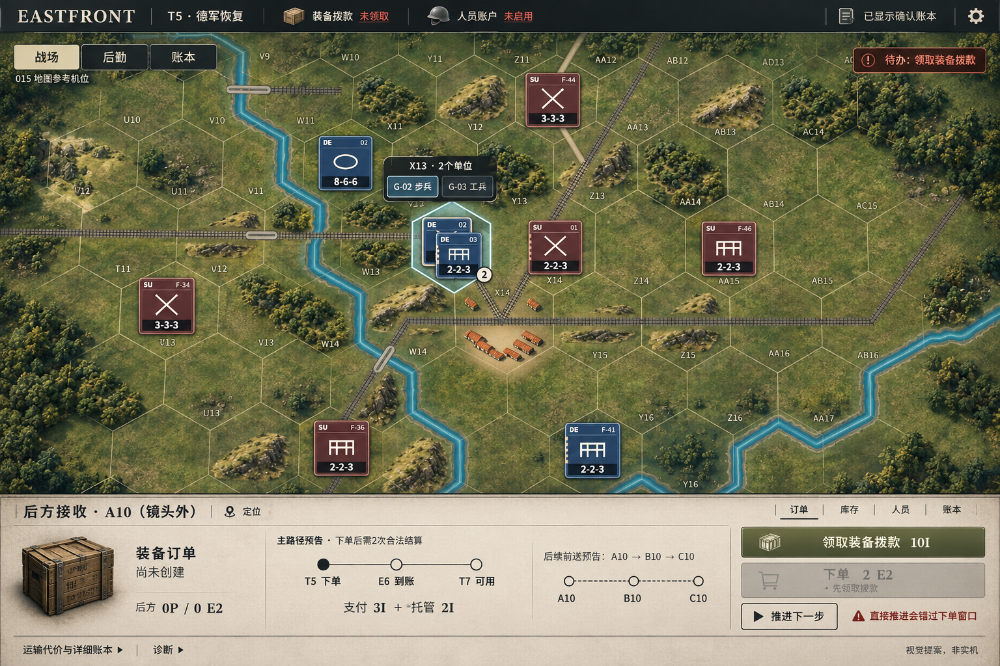
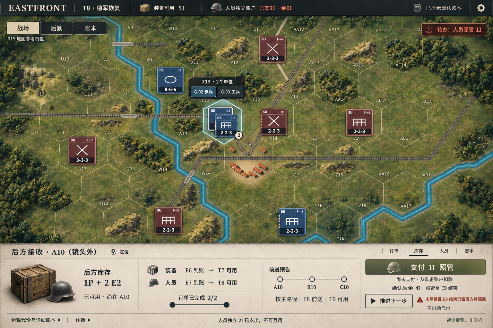

# ART-UI-DIRECTION-021 / Revision 02
2026-10-04。初稿被用户否定后重新研究与构图；此版仍待用户确认。仅视觉提案，非实机。

## 新版图

[原工业页真实T5](../references/ui006-t5-original.png) · [被否定的初稿](../proposals/t5-before-order.png)

## 实际看过什么，借鉴什么
本次阅读来源正文并实际查看了下列五张截图；没有以搜索摘要代替看图。各图原网址、文件散列和字节数见manifest.json。它们是研究参考，不能成为游戏运行素材。

|来源|实际看到的内容|用于本版 / 未采用|
|---|---|---|
|[文明VII：官方Steam商店](https://store.steampowered.com/app/1295660/Sid_Meiers_Civilization_VII/)，截图ss_8c1226…|无HUD的游戏场景：岩体阴影、岸边地表变化、连续城市体积；不是工业界面截图|仅参考地形/城市的整体材质。未移植古代建筑、单位、地形|
|同一官方商店，截图ss_6461e…|Empire's Legacy全屏卡片菜单|作为反例：不把巨型菜单、大卡片、装饰金框搬进常驻战场界面|
|[Victoria3开发日志49](https://www.paradoxinteractive.com/games/victoria-3/news/dev-diary-49-graphic-overview)，Buildings配图|开发期WIP，建筑具象缩略图、生产方式图标和紧凑行列|库存用物资图标识别，不只剩文字；未照搬维多利亚花纹和建筑卡片墙|
|同篇Market配图|开发期WIP，窄模式栏、商品图标、对齐账目|常驻入口收窄，详细账目按需打开；不复制经济系统|
|[HOI4官方Trains and Supply日志，2021-09-01](https://store.steampowered.com/news/posts/?appids=394360&enddate=1631106048&feed=steam_community_announcements)，Hub配图|补给地图局部图：节点、铁路与区域叠层；不是完整生产页|节点和线路要表达关系。本案A10在镜头外，采用明确标注的独立前送示意；不在X14伪造路线，不引入HOI4补给规则|

补充阅读：[CivVII经济设计负责人Edward Zhang的开发日志原文转载](https://www.ezgamedesign.com/dev-blogs/managing-your-empire)，用于理解管理复杂度；其图片403，未计作已查看图片。文明官网正文403、官方Steam公告文本解析未得到正文；随后选取官方商店公开截图。浏览器查看图片超时后停止该通道，公开图片通过普通HTTP取得并本地查看；没有绕过账号、访问控制或403资源。

## 这版具体改变
- 移除占整列的右侧工业表单，取消底部导航栏，地图横向占满；顶部只保留阶段、独立账户和确认状态。
- 底部是一条低矮连续操作台：对象与库存、时点/费用、当前主操作从左至右连接。减少反复分组卡片。
- 使用暖灰纸面、深色细线、具象物资图标建立军用记录语言。材质只承担对象与操作辨识，不靠全局滤镜或金色装饰。
- X13双单位的选择入口紧靠兵牌。底部明确写A10“镜头外”，避免把地图选中单位误认为A10接收库；定位只是待实现的界面提案。
- 当前值和后续时点分开：T5“未创建”与未来主路径；T8当前A10库存、已完成订单、未付款照管与未来前送。
- 主操作与NEXT并存，NEXT保留风险说明；并未替用户选择或支付。

## 数据与交互契约
继续使用上级verified-checkpoints.json：UI006浏览器v0/v37与018账本核对的T5/T8。没有重跑交易，没有虚构新增资源。
T5：grant未领，order不存在，后方0P/0E2。领取10I后才能下单；3I支付+2I托管、E6到账/T7可用均为预测。图中T5实心圆表示当前回合，不表示订单已提交；正式组件应将“当前时点”与“完成状态”分开，避免歧义。
T8：装备5I；后方1P+2E2；人员独立2I已支，余0；照管1I未付，确认后才余4I。人员若未照管且E8结束仍留后方将隔离；支付后至E9结束。前送E8/T9仍为主路径预告，不是已到账。
七操作ALLOCATE_I、PLACE_ORDER、ACTIVATE_PERSONNEL、APPLY_PERSONNEL、CARE、NEXT、RECOVER及资格、付款、托管、时点、共享恢复次数全部沿用原契约；图只显示当前上下文的操作，其余在对应页签。
R1全七操作锁定规则沿用：提交结果先持久化；fresh GET前锁定、只恢复读取；未知请求仅原字段重试。正式实现异常必须在主操作区域显示常驻锁定条，不藏进诊断。此次未画异常状态，不等于验收。
不改Core、协议、交易、地图、FOW、生产服务；020不产生规则功能。

## 可实现范围及成本
沿用015五张图集和既有真实地图渲染。新HUD的版式、分隔、页签、折叠账本、时间/路径示意由CSS和SVG实现，不能以整张图代替地图。
本稿新增了具象箱子/钢盔的UI图标方向，现有素材未证明有匹配成品。确认后只需制作一张至多512×256的透明UI小图集（箱子/人员/接收等小图标），RGBA解码上限524,288字节；压缩包体尚未制作，不能预报实测值。第三方截图/图标不得进入运行包。
本次运行包体、Canvas、DOM增量仍为0，因为只新增研究文件；PNG字节数见manifest.json。预计纸面可用纯CSS微弱底色/边线实现，不增加整屏材质或实时光照。启动、GPU、华为与移动端触控未验；旧708ms问题保留。

## 质量边界与收口
两张图具有一致构图和主要布局；人工看过关键账目、库存、费用与期限。生成图并非像素锁定，细小坐标、外围林地和地物仍有增绘/漂移；**这些不是获准修改真实地形的方案**。015原截图和真实地图数据始终优先，正式实现须按真实格位复原，不能把生成林地或道路写进地图。
因此不宣称地图语义、点击、触控、堆叠或运输实际通过。300%实机、真实对象定位和R1组件交互留到确认实施后验收。
只交这一套重做候选，不自动追加精修或实施。原提案保留为被否定的历史记录。仅research目录，独立分支远端保存，[CF-Pages-Skip]，不合并/部署。
